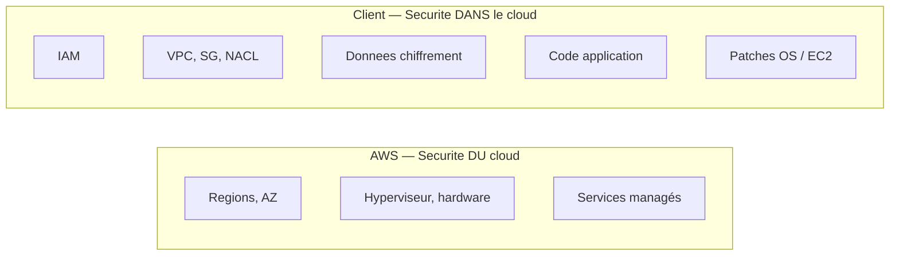

# 00 — Théorie : sécurité AWS dans LocalStack

> **Objectif de ce document :** poser le cadre théorique du cours et clarifier **ce que LocalStack permet vraiment d'apprendre en sécurité** et ce qui reste purement théorique. À lire avant tout TP.

---

## Sommaire

1. [Pourquoi un cours de sécurité AWS dans LocalStack ?](#pourquoi)
2. [Modèle de responsabilité partagée AWS](#responsabilite)
3. [Les 7 principes de conception de sécurité AWS](#design)
4. [Comment LocalStack se positionne face à AWS](#positionnement)
5. [Tableau de compatibilité LocalStack — sécurité](#compat)
6. [Pourquoi certains services ne sont pas couverts en TP](#exclus)
7. [Choix techniques du cours](#choix)
8. [Avertissements transversaux](#avertissements)
9. [Références](#references)

---

## 1. Pourquoi un cours de sécurité AWS dans LocalStack ?

Apprendre la sécurité AWS coûte cher si on tente tout sur un compte AWS réel :

- créer un VPC, des Security Groups, des rôles IAM est gratuit,
- mais activer **GuardDuty**, **Security Hub**, **AWS Config**, **CloudTrail** sur plusieurs comptes coûte rapidement plusieurs dizaines de dollars par mois,
- et la moindre erreur (bucket public oublié, clé d'accès commitée sur GitHub) peut générer une facture surprise.

**LocalStack** permet d'**émuler les APIs AWS** dans un conteneur Docker. Vous écrivez du **Terraform** et du **boto3** identiques à AWS, sans facture, sans risque, sans connexion Internet sortante côté AWS.

> **Limite fondamentale :** LocalStack émule des **APIs**, pas les comportements internes d'AWS. Beaucoup de mécanismes de sécurité (enforcement IAM, filtrage SG/NACL, isolation VPC, monitoring profond) ne sont **pas reproduits** ou seulement **mockés**.

Ce cours est donc utile pour :

- comprendre la **logique** et la **syntaxe** des contrôles de sécurité AWS,
- s'entraîner à écrire **policies, rôles, règles de chiffrement, alarmes, automatisations**,
- préparer la certification **AWS Certified Security – Specialty (SCS-C02)** sur la partie théorique et IaC.

Il **n'est pas suffisant** pour valider la posture sécurité d'un environnement réel.

---

## 2. Modèle de responsabilité partagée AWS

| Qui ? | Ce qu'il sécurise |
|---|---|
| **AWS** | Le **datacenter**, le matériel, l'hyperviseur, les services managés eux-mêmes, la disponibilité de la région. |
| **Client** | Les **identités** (IAM), le **réseau** dans son VPC, le **chiffrement** de ses données, le **code applicatif**, les **patches OS** sur ses EC2. |

LocalStack ne reproduit pas la partie « AWS » (vous tournez localement). Le cours travaille donc **uniquement la partie client**, qui est aussi celle dont vous serez responsable en entreprise.

---

## 3. Les 7 principes de conception de sécurité AWS

Issus du Well-Architected Framework, pilier Sécurité :

1. **Mettre en place une base d'identité forte** : un humain = une identité, principe du moindre privilège.
2. **Activer la traçabilité** : logger tout, monitorer tout (CloudTrail, CloudWatch).
3. **Appliquer la sécurité à toutes les couches** : réseau, host, application, données.
4. **Automatiser les bonnes pratiques** : IaC, scan, auto-remédiation.
5. **Protéger les données en transit et au repos** : TLS, chiffrement KMS / SSE.
6. **Garder les humains loin des données** : pas de SSH direct sur les bases.
7. **Se préparer aux incidents** : runbooks, simulation, response playbooks.

Le cours couvre concrètement les principes **1, 2, 3, 4, 5, 7**.

---

## 4. Comment LocalStack se positionne face à AWS

| Aspect | AWS réel | LocalStack Hobby/Student |
|---|---|---|
| Création de ressources via API | OK | OK |
| Persistance entre redémarrages | OK | OK avec `PERSISTENCE=1` |
| Politique IAM **appliquée** (deny réel) | OK | **Mocké** par défaut |
| Filtrage Security Groups / NACL | OK | **Aucun filtrage** |
| Isolation VPC | OK | **Aucune isolation** |
| CloudTrail complet | OK | Couverture partielle |
| GuardDuty, Security Hub, AWS Config | OK | Non disponibles en plan gratuit |
| Coût | Facturable | Gratuit (compte LocalStack + token) |

LocalStack est **excellent pour apprendre la syntaxe et la logique** et **médiocre pour tester l'effet réel** d'un contrôle de sécurité.

---

## 5. Tableau de compatibilité LocalStack — sécurité

> Vérifié pour le plan **Hobby** et **Student** (gratuits) avec Auth Token, image `localstack/localstack:latest`.

### 5.1. Identités et accès

| Sujet | Création API | Effet réel | Verdict cours |
|---|---|---|---|
| `aws_iam_user`, `aws_iam_group`, `aws_iam_role` | OK | n/a (déclaration) | Pratique TP 3 |
| `aws_iam_policy`, `aws_iam_*_policy_attachment` | OK | **Mocké** : pas d'enforcement par défaut | Pratique TP 3 + encart |
| `aws_iam_access_key` | OK | n/a | Pratique TP 3 |
| Federation SSO, IAM Identity Center | Non | n/a | Hors cours |

### 5.2. Réseau

| Sujet | Création API | Effet réel | Verdict cours |
|---|---|---|---|
| `aws_vpc`, `aws_subnet`, `aws_internet_gateway` | OK | Pas de routage réel | Pratique TP 4 |
| `aws_route_table`, `aws_route_table_association` | OK | n/a | Pratique TP 4 |
| `aws_security_group`, `aws_security_group_rule` | OK | **Aucun filtrage** | Pratique TP 4 + encart |
| `aws_network_acl` | OK | **Aucun filtrage** | Pratique TP 4 + encart |
| ELB / ALB, ACM | Non | n/a | Hors cours |

### 5.3. Protection des données

| Sujet | Création API | Effet réel | Verdict cours |
|---|---|---|---|
| `aws_s3_bucket` + `aws_s3_bucket_versioning` | OK | OK | Pratique TP 5 |
| `aws_s3_bucket_public_access_block` | OK | OK | Pratique TP 5 |
| `aws_s3_bucket_server_side_encryption_configuration` | OK | OK | Pratique TP 5 |
| `aws_s3_bucket_logging` | OK | OK | Pratique TP 5 |
| `aws_kms_key`, `aws_kms_alias` | OK | OK (encrypt/decrypt fonctionnels) | Pratique TP 5 |
| `aws_secretsmanager_secret` | OK | OK | Mentionné TP 5 |

### 5.4. Détection, logging, monitoring

| Sujet | Création API | Effet réel | Verdict cours |
|---|---|---|---|
| `aws_cloudwatch_log_group` | OK | OK | Pratique TP 6 |
| `aws_cloudwatch_log_metric_filter` | OK | OK | Pratique TP 6 |
| `aws_cloudwatch_metric_alarm` | OK | OK (transition d'état) | Pratique TP 6 |
| CloudTrail | Partiel | Couverture incomplète | Théorie M6 + encart |
| GuardDuty | Non (plan payant) | n/a | Théorie M6 / M8 |
| Security Hub | Non (plan payant) | n/a | Théorie M6 / M8 |
| AWS Config | Non (plan payant) | n/a | Théorie M6 / M8 |

### 5.5. Incident response

| Sujet | Création API | Effet réel | Verdict cours |
|---|---|---|---|
| `aws_lambda_function` (Python) | OK | OK | Pratique TP 7 |
| `aws_cloudwatch_event_rule` (EventBridge) | OK | OK | Pratique TP 7 |
| `aws_lambda_permission` | OK | OK | Pratique TP 7 |
| SSM Automation | Partiel | Limite forte | Théorie M7 |

---

## 6. Pourquoi certains services ne sont pas couverts en TP

| Service | Raison |
|---|---|
| **AWS Organizations / SCPs** | Pas disponible en LocalStack gratuit, et n'a de sens que sur plusieurs comptes AWS. |
| **Security Hub** | Plan LocalStack Pro. Apporterait une fausse impression de couverture. |
| **GuardDuty** | Plan LocalStack Pro. Détection ML non émulée. |
| **AWS Config rules** | Plan LocalStack Pro. Sans rules, pas de détection de drift. |
| **ACM / ELB / TLS termination** | Faible utilité en local et non émulé fidèlement. |

Ces services restent **étudiés en théorie** dans M2, M6, M8, mais aucun TP n'est demandé : il vaut mieux ne rien faire que faire un TP qui donnerait l'illusion d'un contrôle de sécurité.

---

## 7. Choix techniques du cours

| Choix | Raison |
|---|---|
| Une seule méthode : **Docker Compose + `Dockerfile.tools`** | Évite de demander à l'étudiant d'installer Terraform, AWS CLI, Python sur sa machine. |
| **Auth Token LocalStack obligatoire** | Aligné sur les plans Hobby / Student pérennes. Pas de dépendance au bypass legacy `LOCALSTACK_ACKNOWLEDGE_ACCOUNT_REQUIREMENT` qui expire en novembre 2026. |
| **Terraform** comme outil IaC principal | Standard de l'industrie. |
| **boto3** comme client Python | Permet des tests `assert` simples. |
| Endpoint LocalStack `http://localstack:4566` | Nom de service Docker. |
| `AWS_ACCESS_KEY_ID=test` / `AWS_SECRET_ACCESS_KEY=test` | Convention LocalStack. Aucune fuite possible. |

---

## 8. Avertissements transversaux

Ces encarts seront rappelés dans chaque TP concerné :

> **Mock vs réel — IAM enforcement :** par défaut, LocalStack **n'évalue pas les policies IAM**. Un appel `s3:DeleteBucket` réussit même si la policy l'interdit. Vous apprenez la syntaxe et la logique, **pas la garantie d'effet**.

> **Mock vs réel — réseau :** Security Groups, NACLs et tables de routage **n'imposent aucun filtrage**. Le but est d'apprendre l'IaC d'un VPC sécurisé.

> **Mock vs réel — CloudTrail :** la couverture est partielle ; certains événements ne sont pas tracés. Toujours valider sur un compte AWS réel avant de s'appuyer dessus en production.

> **Mock vs réel — KMS :** les opérations `Encrypt`, `Decrypt`, `GenerateDataKey` fonctionnent, mais la clé reste locale. La rotation et les audits CloudTrail spécifiques aux clés sont limités.

---

## 9. Références

- AWS — Modèle de responsabilité partagée : https://aws.amazon.com/compliance/shared-responsibility-model/
- AWS — Well-Architected Security Pillar : https://docs.aws.amazon.com/wellarchitected/latest/security-pillar/welcome.html
- AWS — IAM Best Practices : https://docs.aws.amazon.com/IAM/latest/UserGuide/best-practices.html
- AWS — VPC Security Best Practices : https://docs.aws.amazon.com/vpc/latest/userguide/vpc-security-best-practices.html
- AWS — KMS Concepts : https://docs.aws.amazon.com/kms/latest/developerguide/concepts.html
- LocalStack — Services coverage : https://docs.localstack.cloud/aws/integrations/aws-sdks/
- LocalStack — Auth Token : https://docs.localstack.cloud/aws/getting-started/auth-token/
- LocalStack — Pricing : https://www.localstack.cloud/pricing
- Certification SCS-C02 (Exam Guide) : https://d1.awsstatic.com/training-and-certification/docs-security-specialty/AWS-Certified-Security-Specialty_Exam-Guide.pdf

<a href="#top">↑ Retour en haut</a>

