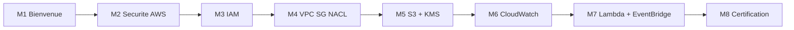

# Chapitre 1 — Théorie : bienvenue dans le cours

> **Objectif du module :** poser le décor du cours, expliquer le plan, les outils, les attentes et la méthode de travail.

---

## Sommaire

1. [À qui ce cours s'adresse](#qui)
2. [Ce que vous saurez faire à la fin](#objectifs)
3. [Plan général en 8 modules](#plan)
4. [Outils utilisés](#outils)
5. [Méthode de travail](#methode)
6. [Comment lire un TP `Nb-...md`](#lire-tp)
7. [Charte du cours](#charte)
8. [Références](#references)

---

## 1. À qui ce cours s'adresse

Ce cours s'adresse à toute personne souhaitant apprendre la **sécurité AWS** sans engager de frais sur un compte AWS réel. Les prérequis sont :

- savoir ouvrir un terminal,
- avoir Docker Desktop installé,
- des notions basiques de cloud (région, service, ressource) sont un plus mais non obligatoires.

Le cours est rédigé en **français** et utilise exclusivement **LocalStack** pour simuler AWS.

---

## 2. Ce que vous saurez faire à la fin

- Expliquer le **modèle de responsabilité partagée** AWS.
- Écrire et appliquer des **policies IAM**, créer des **users / groups / roles** en Terraform.
- Construire un **VPC sécurisé** avec **Security Groups** et **NACL**.
- **Sécuriser un bucket S3** : versioning, public access block, SSE-S3, SSE-KMS.
- Créer une **clé KMS** et chiffrer/déchiffrer des données avec `boto3`.
- Mettre en place **CloudWatch Logs**, **metric filters** et **alarms**.
- Implémenter une **auto-remédiation** Lambda + EventBridge.
- Identifier les services AWS de sécurité que LocalStack ne couvre pas et savoir ce qu'ils apportent en production.

---

## 3. Plan général en 8 modules

| # | Module | Type |
|---:|---|---|
| 1 | Bienvenue | Théorie |
| 2 | Introduction à la sécurité AWS | Théorie |
| 3 | IAM | Théorie + pratique |
| 4 | VPC / SG / NACL | Théorie + pratique |
| 5 | Protection des données (S3 + KMS) | Théorie + pratique |
| 6 | Logging et monitoring | Théorie + pratique |
| 7 | Incident response | Théorie + pratique |
| 8 | Préparer la certification SCS-C02 | Théorie |

> **Pourquoi pas de TP M1, M2, M8 ?** Ces modules sont théoriques par nature : politiques, gouvernance, certification. Ajouter du code juste « pour faire un TP » n'aurait pas de valeur.

---

## 4. Outils utilisés

| Outil | Rôle |
|---|---|
| **Docker Desktop** | Exécute LocalStack et le conteneur d'outils. |
| **LocalStack** | Émulateur des APIs AWS. |
| **Terraform** | Infrastructure as Code, dans le conteneur `tools`. |
| **AWS CLI** | Validation rapide, dans le conteneur `tools`. |
| **boto3** | Tests Python, dans le conteneur `tools`. |
| **VS Code (suggéré)** | Éditeur. |

Aucun de ces outils, sauf Docker Desktop, n'est installé sur votre machine. Tout passe par les conteneurs.

---

## 5. Méthode de travail

1. Lire le `00-theorie-aws-security-localstack.md`.
2. Pour chaque module : lire le document `Na-...md`, puis faire le TP `Nb-...md` quand il existe.
3. Après chaque TP : `docker compose down -v` pour nettoyer.
4. Ne **jamais commit `.env`** (il contient votre `LOCALSTACK_AUTH_TOKEN`).
5. Garder en tête la distinction **réel vs mock** dans LocalStack : voir [`00-theorie`](00-theorie-aws-security-localstack.md).

---

## 6. Comment lire un TP `Nb-...md`

Chaque TP suit la structure :

1. Encarts **réel vs mock** propres au sujet.
2. Prérequis matériels (Docker démarré, token disponible).
3. Parties numérotées **I → XXII** : chaque partie a un objectif clair, une commande à exécuter, une question à se poser.
4. Mini-rapport à compléter à la fin (questions de réflexion).
5. Corrigé minimal.
6. Références externes.

---

## 7. Charte du cours

- **Aucun secret réel n'est commit.** Seul `.env.example` est versionné.
- **Aucun fichier binaire**, pas de `*.tfstate` ni de `.terraform/` dans les rendus.
- **Endpoint LocalStack** unique : `http://localstack:4566` (depuis l'intérieur de Docker).
- Identifiants AWS factices : `AWS_ACCESS_KEY_ID=test`, `AWS_SECRET_ACCESS_KEY=test`.

---

## 8. Références

- README du cours : [`README.md`](README.md)
- Théorie générale : [`00-theorie-aws-security-localstack.md`](00-theorie-aws-security-localstack.md)
- LocalStack — Auth Token : https://docs.localstack.cloud/aws/getting-started/auth-token/
- AWS Well-Architected — Security Pillar : https://docs.aws.amazon.com/wellarchitected/latest/security-pillar/welcome.html

---

➡ Module suivant : [`02a-Chapitre2-Theorie-securite-aws.md`](02a-Chapitre2-Theorie-securite-aws.md)
