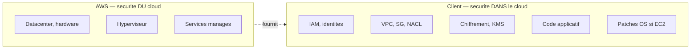
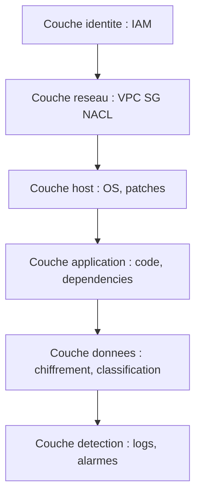

# Chapitre 2 — Théorie : introduction à la sécurité AWS

> **Objectif du module :** comprendre comment AWS structure la sécurité, qui est responsable de quoi, et comment ce cadre s'applique (ou pas) dans LocalStack.

---

## Sommaire

1. [Le modèle de responsabilité partagée](#partage)
2. [Les 7 principes de conception sécurité](#principes)
3. [Les couches de défense](#couches)
4. [Cartographie des services AWS de sécurité](#carto)
5. [Ce qui est testable dans LocalStack](#localstack)
6. [Glossaire minimal](#glossaire)
7. [Quiz d'auto-évaluation](#quiz)
8. [Références](#references)

---

## 1. Le modèle de responsabilité partagée

| Ressource AWS | Responsable de la **configuration** | Responsable du **service sous-jacent** |
|---|---|---|
| EC2 | Client (OS, ports, patches) | AWS (hyperviseur, hardware) |
| S3 | Client (policies, encryption) | AWS (durabilité, disponibilité) |
| Lambda | Client (code, rôle d'exécution) | AWS (runtime, scaling) |
| RDS | Client (security group, paramètres) | AWS (patches DB engine) |

**Conséquence pour ce cours :** tout ce qu'on apprend ici (IAM, VPC, chiffrement, monitoring) est **la responsabilité du client**, donc c'est exactement ce que vous devrez configurer en entreprise.

---

## 2. Les 7 principes de conception sécurité

| # | Principe | Exemple |
|---:|---|---|
| 1 | Identité forte | MFA, IAM Identity Center, principe du moindre privilège |
| 2 | Traçabilité | CloudTrail, CloudWatch, Config |
| 3 | Sécurité à toutes les couches | Réseau, host, application, données |
| 4 | Automatiser la sécurité | IaC, scans, auto-remédiation |
| 5 | Protéger les données | Chiffrement at rest (KMS, SSE) et en transit (TLS) |
| 6 | Tenir les humains loin des données | Pas de SSH direct sur la base, accès via APIs |
| 7 | Préparer la réponse aux incidents | Runbooks, simulation, Lambda d'auto-remédiation |

Ce cours met en pratique : **1** (TP 3), **3** (TP 4), **4 et 5** (TP 5), **2** (TP 6), **7** (TP 7).

---

## 3. Les couches de défense

| Couche | Service AWS principal | Couvert en TP ? |
|---|---|---|
| Identité | IAM | TP 3 |
| Réseau | VPC, SG, NACL | TP 4 (syntaxe IaC seulement) |
| Host | EC2 SSM | Hors cours |
| Application | revue de code, secrets, dépendances | Hors cours |
| Données | S3, KMS, Secrets Manager | TP 5 |
| Détection | CloudWatch, CloudTrail, GuardDuty, Config | TP 6 (partiel) |

---

## 4. Cartographie des services AWS de sécurité

| Famille | Services | Statut en plan gratuit LocalStack |
|---|---|---|
| **Identité** | IAM, IAM Identity Center, STS, Cognito | IAM OK, le reste limité |
| **Détection** | CloudTrail, CloudWatch, AWS Config, GuardDuty, Security Hub, Detective | CloudWatch OK, CloudTrail partiel, autres non couverts |
| **Protection** | KMS, Secrets Manager, ACM, WAF, Shield | KMS OK, Secrets Manager OK, ACM/WAF/Shield non couverts |
| **Réseau** | VPC, SG, NACL, Route Tables, ELB, ACM, Route 53 | Création API OK, **filtrage non émulé** |
| **Réponse aux incidents** | Lambda, EventBridge, SSM Automation | Lambda et EventBridge OK |

---

## 5. Ce qui est testable dans LocalStack

Reportez-vous au tableau complet dans [`00-theorie-aws-security-localstack.md`](00-theorie-aws-security-localstack.md). Résumé court :

| Niveau | Ce qu'on peut faire dans LocalStack |
|---|---|
| **Très bien** | IAM (création), S3 hardening, KMS encrypt/decrypt, CloudWatch Logs/Alarms, Lambda + EventBridge |
| **Partiel** | CloudTrail, IAM enforcement (mocké) |
| **Non disponible** | GuardDuty, Security Hub, AWS Config rules, ACM, WAF, Shield |

> **Astuce :** considérer LocalStack comme un **simulateur de syntaxe** plutôt qu'un simulateur de comportement.

---

## 6. Glossaire minimal

- **IAM** : Identity and Access Management. Système d'identités d'AWS.
- **Policy** : document JSON décrivant des permissions (Allow/Deny + Action + Resource).
- **Role** : identité assumable par un service ou par une autre identité, via STS.
- **VPC** : Virtual Private Cloud. Réseau virtuel isolé.
- **SG** : Security Group. Pare-feu **stateful** au niveau de l'ENI.
- **NACL** : Network ACL. Pare-feu **stateless** au niveau du subnet.
- **SSE** : Server-Side Encryption.
- **KMS** : Key Management Service.
- **CloudWatch** : monitoring, logs, alarms.
- **CloudTrail** : journal des appels d'API AWS.
- **EventBridge** : bus d'événements (ex-CloudWatch Events).
- **Lambda** : fonction serverless.

---

## 7. Quiz d'auto-évaluation

1. Qui est responsable du **patch de l'OS d'une EC2** : AWS ou le client ?
2. Qui est responsable du **chiffrement at rest d'un bucket S3** : AWS ou le client ?
3. Citer trois services AWS qui aident à la **détection** d'événements suspects.
4. Un Security Group fait-il du filtrage **stateful** ou **stateless** ?
5. Quel service permet le **chiffrement avec clé gérée** par le client ?

> Réponses : 1. Client. 2. Client (AWS fournit l'option). 3. CloudTrail, CloudWatch, GuardDuty. 4. Stateful. 5. KMS.

---

## 8. Références

- AWS — Modèle de responsabilité partagée : https://aws.amazon.com/compliance/shared-responsibility-model/
- AWS — Well-Architected, pilier Sécurité : https://docs.aws.amazon.com/wellarchitected/latest/security-pillar/welcome.html
- AWS — Security Reference Architecture : https://docs.aws.amazon.com/prescriptive-guidance/latest/security-reference-architecture/welcome.html

---

⬅ Module précédent : [`01a-Chapitre1-Theorie-bienvenue.md`](01a-Chapitre1-Theorie-bienvenue.md)  
➡ Module suivant : [`03a-Chapitre3-Theorie-iam.md`](03a-Chapitre3-Theorie-iam.md)
