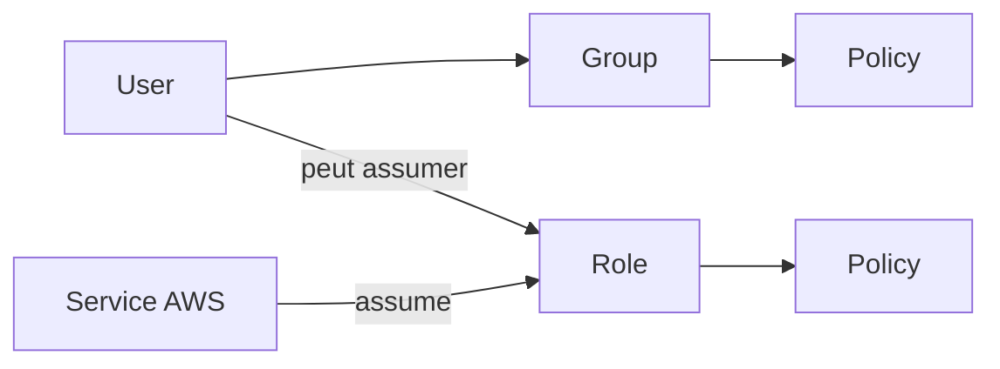
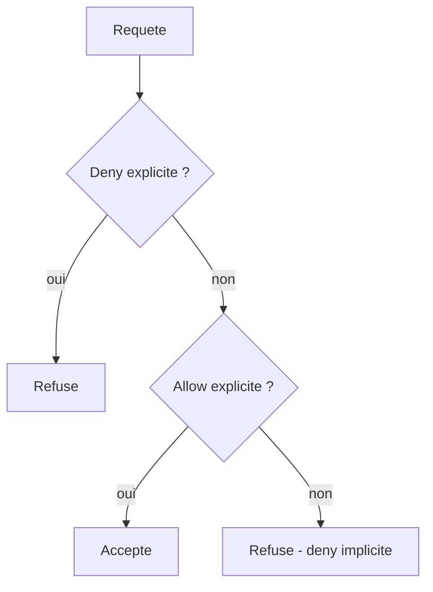

# Chapitre 3 — Théorie : IAM (Identity and Access Management)

> **Objectif du module :** comprendre les **users, groups, roles, policies** d'AWS IAM, le format JSON d'une policy, et comment le principe du **moindre privilège** s'applique en IaC.

---

## Sommaire

1. [Pourquoi IAM est central](#central)
2. [Les 4 entités de base](#entites)
3. [Format JSON d'une policy](#json)
4. [Évaluation d'une policy (logique Allow/Deny)](#evaluation)
5. [Managed vs Inline policies](#managed-inline)
6. [Rôles et STS](#roles)
7. [Bonnes pratiques IAM](#bonnes-pratiques)
8. [Réel vs LocalStack — encart à connaître par cœur](#realmock)
9. [Quiz d'auto-évaluation](#quiz)
10. [Références](#references)

---

<a id="central"></a>

## 1. Pourquoi IAM est central

Toute action sur AWS passe par une **vérification IAM**. C'est la première barrière de sécurité. Un IAM mal configuré rend les autres barrières (VPC, KMS, etc.) inutiles.

> **Astuce :** une bonne stratégie IAM = un humain = une identité, et chaque service utilise un **rôle** plutôt qu'une clé d'accès.

---

<a id="entites"></a>

## 2. Les 4 entités de base



| Entité | Définition | Quand l'utiliser |
|---|---|---|
| **User** | identité d'un humain ou d'un compte de service legacy | rares cas humains directs |
| **Group** | conteneur logique d'utilisateurs | facilite la gestion par rôle métier |
| **Role** | identité **assumable**, sans credentials permanents | services AWS (Lambda, EC2…), federation, accès cross-account |
| **Policy** | document JSON listant Allow/Deny | définit ce qui est permis |

---

<a id="json"></a>

## 3. Format JSON d'une policy

```json
{
  "Version": "2012-10-17",
  "Statement": [
    {
      "Sid": "AllowReadBucket",
      "Effect": "Allow",
      "Action": [
        "s3:GetObject",
        "s3:ListBucket"
      ],
      "Resource": [
        "arn:aws:s3:::my-bucket",
        "arn:aws:s3:::my-bucket/*"
      ],
      "Condition": {
        "StringEquals": {
          "aws:RequestedRegion": "us-east-1"
        }
      }
    }
  ]
}
```

| Champ | Sens |
|---|---|
| `Version` | toujours `2012-10-17` |
| `Statement` | liste de déclarations |
| `Sid` | identifiant lisible (optionnel) |
| `Effect` | `Allow` ou `Deny` |
| `Action` | une ou plusieurs actions AWS (`s3:GetObject`, …) |
| `Resource` | un ou plusieurs ARN |
| `Condition` | conditions optionnelles (IP source, MFA, région, tag…) |

---

<a id="evaluation"></a>

## 4. Évaluation d'une policy (logique Allow/Deny)

Règle simple :

1. **Deny explicite** gagne toujours.
2. Sinon, il faut au moins un **Allow** applicable.
3. Sinon, **deny implicite** (par défaut, rien n'est autorisé).



---

<a id="managed-inline"></a>

## 5. Managed vs Inline policies

| Type | Description | Recommandation |
|---|---|---|
| **AWS Managed Policy** | gérée par AWS, ex. `AmazonS3ReadOnlyAccess` | rapide mais peu fine |
| **Customer Managed Policy** | écrite par vous, réutilisable | **recommandé** |
| **Inline Policy** | attachée à une seule identité | usage spécifique, jetable |

> **Bonne pratique :** privilégier les **Customer Managed Policies** car elles sont versionnables et réutilisables.

---

<a id="roles"></a>

## 6. Rôles et STS

Un **rôle** ne contient pas de credentials. On l'**assume** via STS (Security Token Service), qui délivre des **credentials temporaires**.

Cas classiques :

- **Lambda → S3** : Lambda assume un rôle d'exécution qui lui donne `s3:PutObject` sur un bucket précis.
- **EC2 → DynamoDB** : EC2 a un **instance profile** qui contient un rôle.
- **Cross-account** : un user de compte A assume un rôle dans le compte B.

Trust policy d'un rôle Lambda :

```json
{
  "Version": "2012-10-17",
  "Statement": [{
    "Effect": "Allow",
    "Principal": { "Service": "lambda.amazonaws.com" },
    "Action": "sts:AssumeRole"
  }]
}
```

---

<a id="bonnes-pratiques"></a>

## 7. Bonnes pratiques IAM

1. **Pas de clés d'accès** pour les humains : utilisez l'IAM Identity Center / SSO.
2. **Principe du moindre privilège** : `Resource` aussi spécifique que possible.
3. **Rotation** des clés d'accès résiduelles.
4. **MFA** obligatoire pour le root et les humains.
5. **CloudTrail** activé pour auditer.
6. **Tags** sur les rôles pour la traçabilité.
7. **Aucune policy `*:*`** en production.

---

<a id="realmock"></a>

## 8. Réel vs LocalStack — encart à connaître par cœur

> **Mock vs réel — IAM enforcement :**  
> Par défaut, LocalStack **n'applique pas les policies IAM**. Un appel comme `s3:DeleteBucket` peut réussir même si la policy attachée à l'utilisateur l'interdit.  
> Ce que vous apprenez dans le TP 3 : la **syntaxe** des policies, la création de **users / groups / roles**, le format JSON, l'attachement, l'évaluation théorique.  
> Ce que vous **n'apprenez pas** : l'effet réel d'un `Deny` ou d'une `Condition`.

Pour vérifier l'enforcement, il existe (pour info) une option payante `IAM_SOFT_MODE=0` dans LocalStack Pro. Dans ce cours, on reste sur **Hobby / Student** : on apprend la logique et on l'écrit correctement.

---

<a id="quiz"></a>

## 9. Quiz d'auto-évaluation

1. Quel champ d'une policy contrôle la **portée** : `Action` ou `Resource` ?
2. Si un user a un `Allow s3:*` et un `Deny s3:DeleteBucket`, peut-il supprimer un bucket ?
3. À quoi sert un **rôle** plutôt qu'un **user** pour une Lambda ?
4. Quelle est la différence entre une **trust policy** et une **permission policy** ?
5. Dans LocalStack, qu'est-ce qui est **mocké** côté IAM ?

> Réponses : 1. Les deux ; `Action` dit quoi, `Resource` dit où. 2. Non, le Deny gagne. 3. Pas de credentials permanents, accès temporaire via STS. 4. Trust = qui peut assumer le rôle ; permission = ce que le rôle peut faire. 5. L'enforcement (l'évaluation effective des Allow/Deny).

---

<a id="references"></a>

## 10. Références

- AWS — IAM User Guide : https://docs.aws.amazon.com/IAM/latest/UserGuide/
- AWS — IAM Best Practices : https://docs.aws.amazon.com/IAM/latest/UserGuide/best-practices.html
- AWS — Policy evaluation logic : https://docs.aws.amazon.com/IAM/latest/UserGuide/reference_policies_evaluation-logic.html
- AWS — STS : https://docs.aws.amazon.com/IAM/latest/UserGuide/id_credentials_temp.html

---

⬅ Précédent : [`02a-Chapitre2-Theorie-securite-aws.md`](02a-Chapitre2-Theorie-securite-aws.md)  
➡ Pratique : [`03b-Chapitre3-Pratique-iam-users-groups-roles-policies.md`](03b-Chapitre3-Pratique-iam-users-groups-roles-policies.md)
