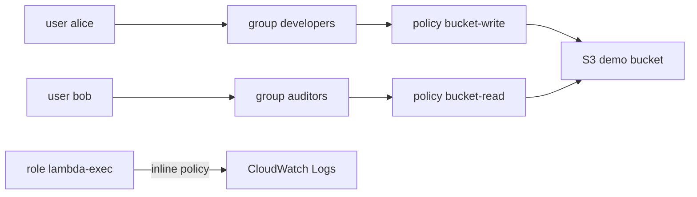

<a id="top"></a>

# Chapitre 3 — Pratique : IAM (users, groups, roles, policies)

> **Module concerné :** M3 — Identity and Access Management.
>
> **Théorie associée :** [`03a-Chapitre3-Theorie-iam.md`](03a-Chapitre3-Theorie-iam.md)
>
> **Solution exécutable :** [`solutions/tp3b/`](solutions/tp3b/)
>
> **Durée estimée :** 90 minutes.

---

> **Mock vs réel — IAM enforcement :** Par défaut, LocalStack **n'applique pas** les policies IAM. Un appel `s3:DeleteBucket` peut réussir même si la policy l'interdit. Vous apprenez la **syntaxe** des policies et la **logique d'évaluation**, pas la garantie d'effet réel.

---

## Sommaire

- [Objectifs pédagogiques](#objectifs)
- [Prérequis](#prerequis)
- [Architecture cible](#archi)
- [Plan du TP (parties I à XV)](#plan)
- [Partie I — Préparer l'environnement](#part1)
- [Partie II — Initialiser le projet](#part2)
- [Partie III — Créer le bucket cible](#part3)
- [Partie IV — Créer les groupes IAM](#part4)
- [Partie V — Créer les users IAM](#part5)
- [Partie VI — Associer users et groupes](#part6)
- [Partie VII — Écrire une policy de lecture S3](#part7)
- [Partie VIII — Écrire une policy d'écriture S3](#part8)
- [Partie IX — Attacher les policies aux groupes](#part9)
- [Partie X — Créer un rôle IAM pour Lambda](#part10)
- [Partie XI — Inline policy pour les logs](#part11)
- [Partie XII — `terraform apply` et validations CLI](#part12)
- [Partie XIII — Lire une policy avec `boto3`](#part13)
- [Partie XIV — Mini-rapport](#part14)
- [Partie XV — Nettoyage](#part15)
- [Barème](#bareme)
- [Corrigé minimal](#corrige)
- [Références](#references)

---

<a id="objectifs"></a>

## Objectifs pédagogiques

À la fin de ce TP, vous saurez :

- créer des **users**, **groups** et **roles** IAM en Terraform,
- écrire des **policies JSON** (Allow, Deny, Condition),
- attacher des **customer-managed policies** à des groupes,
- créer une **trust policy** pour qu'un service AWS assume un rôle,
- vérifier le tout via AWS CLI et boto3.

---

<a id="prerequis"></a>

## Prérequis

- Docker Desktop démarré.
- Compte LocalStack (plan Hobby ou Student) + `LOCALSTACK_AUTH_TOKEN`.
- Avoir lu [`03a-Chapitre3-Theorie-iam.md`](03a-Chapitre3-Theorie-iam.md).

---

<a id="archi"></a>

## Architecture cible



---

<a id="plan"></a>

## Plan du TP (parties I à XV)

| Partie | Sujet |
|---:|---|
| I | Préparer l'environnement (Docker, `.env`) |
| II | Initialiser Terraform |
| III | Bucket S3 cible |
| IV | Groupes IAM |
| V | Users IAM |
| VI | Appartenance aux groupes |
| VII | Policy lecture S3 |
| VIII | Policy écriture S3 |
| IX | Attacher les policies |
| X | Rôle Lambda et trust policy |
| XI | Inline policy logs |
| XII | `apply` + validations CLI |
| XIII | boto3 |
| XIV | Mini-rapport |
| XV | Nettoyage |

---

<a id="part1"></a>

## Partie I — Préparer l'environnement

> **Objectif :** disposer d'un dossier de travail propre avec LocalStack et le conteneur `tools` opérationnels.

Créer un dossier vide pour votre travail. Copier le squelette depuis la solution :

```bash
cd aws-security-with-localstack/solutions/tp3b
cp .env.example .env
```

Éditer `.env` et coller votre `LOCALSTACK_AUTH_TOKEN`.

Construire et démarrer :

```bash
docker compose build
docker compose up -d localstack tools
docker compose ps
```

> **Astuce :** vérifiez que les deux conteneurs sont en état `Up`.

---

<a id="part2"></a>

## Partie II — Initialiser le projet

> **Objectif :** initialiser Terraform et confirmer la connexion au provider AWS pointant vers LocalStack.

```bash
docker compose run --rm tools terraform -chdir=terraform init
```

Vérifier que `terraform/provider.tf` contient bien les `endpoints` pointant vers `http://localstack:4566`.

---

<a id="part3"></a>

## Partie III — Créer le bucket cible

> **Objectif :** disposer d'un bucket S3 dont les ARNs seront référencés dans les policies.

Bloc à ajouter dans `terraform/main.tf` (déjà présent dans la solution) :

```hcl
resource "aws_s3_bucket" "demo" {
  bucket = var.demo_bucket_name
}
```

> **Pourquoi ?** Les policies IAM référencent des ARN précis. Avoir un bucket réel permet d'obtenir des ARN cohérents et de tester la syntaxe.

---

<a id="part4"></a>

## Partie IV — Créer les groupes IAM

> **Objectif :** créer deux groupes représentant deux rôles métier.

```hcl
resource "aws_iam_group" "developers" {
  name = "${var.project}-developers"
  path = "/"
}

resource "aws_iam_group" "auditors" {
  name = "${var.project}-auditors"
  path = "/"
}
```

> **Astuce :** un nom préfixé par le projet évite les collisions si plusieurs étudiants partagent un environnement.

---

<a id="part5"></a>

## Partie V — Créer les users IAM

> **Objectif :** créer deux users humains de démonstration.

```hcl
resource "aws_iam_user" "alice" {
  name = "${var.project}-alice"
  tags = {
    Project = var.project
    Role    = "developer"
  }
}

resource "aws_iam_user" "bob" {
  name = "${var.project}-bob"
  tags = {
    Project = var.project
    Role    = "auditor"
  }
}
```

> **Attention :** en production, ne créez pas d'utilisateurs « humains » directement dans IAM. Utilisez **IAM Identity Center** ou un IdP fédéré. Ici on le fait pour la pédagogie.

---

<a id="part6"></a>

## Partie VI — Associer users et groupes

> **Objectif :** lier chaque user à son groupe métier.

```hcl
resource "aws_iam_user_group_membership" "alice_membership" {
  user   = aws_iam_user.alice.name
  groups = [aws_iam_group.developers.name]
}

resource "aws_iam_user_group_membership" "bob_membership" {
  user   = aws_iam_user.bob.name
  groups = [aws_iam_group.auditors.name]
}
```

---

<a id="part7"></a>

## Partie VII — Écrire une policy de lecture S3

> **Objectif :** comprendre la structure d'une policy JSON, le couple `Allow` + `Deny` conditionnel.

```hcl
data "aws_iam_policy_document" "bucket_read" {
  statement {
    sid       = "ListBucket"
    effect    = "Allow"
    actions   = ["s3:ListBucket"]
    resources = [aws_s3_bucket.demo.arn]
  }
  statement {
    sid       = "ReadObjects"
    effect    = "Allow"
    actions   = ["s3:GetObject"]
    resources = ["${aws_s3_bucket.demo.arn}/*"]
  }
  statement {
    sid       = "DenyUnencryptedTransport"
    effect    = "Deny"
    actions   = ["s3:*"]
    resources = [
      aws_s3_bucket.demo.arn,
      "${aws_s3_bucket.demo.arn}/*",
    ]
    condition {
      test     = "Bool"
      variable = "aws:SecureTransport"
      values   = ["false"]
    }
  }
}

resource "aws_iam_policy" "bucket_read" {
  name        = "${var.project}-bucket-read"
  description = "Lecture seule sur le bucket demo, refuse le transport non chiffre."
  policy      = data.aws_iam_policy_document.bucket_read.json
}
```

> **Pourquoi un `Deny` ?** Le `Deny` explicite gagne toujours. Cette condition refuse toute requête non chiffrée (`HTTP` au lieu de `HTTPS`), même si un Allow couvrirait l'action.

---

<a id="part8"></a>

## Partie VIII — Écrire une policy d'écriture S3

> **Objectif :** écrire une policy plus permissive pour les développeurs.

```hcl
data "aws_iam_policy_document" "bucket_write" {
  statement {
    sid       = "ListBucket"
    effect    = "Allow"
    actions   = ["s3:ListBucket"]
    resources = [aws_s3_bucket.demo.arn]
  }
  statement {
    sid       = "ReadWriteObjects"
    effect    = "Allow"
    actions   = [
      "s3:GetObject",
      "s3:PutObject",
      "s3:DeleteObject",
    ]
    resources = ["${aws_s3_bucket.demo.arn}/*"]
  }
}

resource "aws_iam_policy" "bucket_write" {
  name        = "${var.project}-bucket-write"
  description = "Lecture / ecriture sur le bucket demo."
  policy      = data.aws_iam_policy_document.bucket_write.json
}
```

> **Astuce :** on liste les actions plutôt que d'utiliser `s3:*` pour respecter le **principe du moindre privilège**.

---

<a id="part9"></a>

## Partie IX — Attacher les policies aux groupes

> **Objectif :** attacher chaque policy au bon groupe.

```hcl
resource "aws_iam_group_policy_attachment" "auditors_read" {
  group      = aws_iam_group.auditors.name
  policy_arn = aws_iam_policy.bucket_read.arn
}

resource "aws_iam_group_policy_attachment" "developers_write" {
  group      = aws_iam_group.developers.name
  policy_arn = aws_iam_policy.bucket_write.arn
}
```

---

<a id="part10"></a>

## Partie X — Créer un rôle IAM pour Lambda

> **Objectif :** voir comment un **service AWS** peut assumer un rôle via une **trust policy**.

```hcl
data "aws_iam_policy_document" "lambda_trust" {
  statement {
    sid     = "LambdaAssumeRole"
    effect  = "Allow"
    actions = ["sts:AssumeRole"]
    principals {
      type        = "Service"
      identifiers = ["lambda.amazonaws.com"]
    }
  }
}

resource "aws_iam_role" "lambda_exec" {
  name               = "${var.project}-lambda-exec"
  assume_role_policy = data.aws_iam_policy_document.lambda_trust.json
}
```

> **Pourquoi ?** Lambda ne stocke pas de credentials. Quand elle s'exécute, AWS lui fournit des credentials temporaires en lui faisant **assumer** ce rôle.

---

<a id="part11"></a>

## Partie XI — Inline policy pour les logs

> **Objectif :** donner à la Lambda la permission d'écrire dans CloudWatch Logs.

```hcl
data "aws_iam_policy_document" "lambda_logs" {
  statement {
    sid     = "AllowCloudWatchLogs"
    effect  = "Allow"
    actions = [
      "logs:CreateLogGroup",
      "logs:CreateLogStream",
      "logs:PutLogEvents",
    ]
    resources = ["*"]
  }
}

resource "aws_iam_role_policy" "lambda_logs_inline" {
  name   = "${var.project}-lambda-logs"
  role   = aws_iam_role.lambda_exec.id
  policy = data.aws_iam_policy_document.lambda_logs.json
}
```

> **Astuce :** une **inline policy** est attachée à une seule identité, contrairement à une managed policy réutilisable. Utile pour les permissions très spécifiques.

---

<a id="part12"></a>

## Partie XII — `terraform apply` et validations CLI

```bash
docker compose run --rm tools terraform -chdir=terraform plan
docker compose run --rm tools terraform -chdir=terraform apply -auto-approve
```

Validations :

```bash
docker compose run --rm tools aws --endpoint-url=http://localstack:4566 iam list-users
docker compose run --rm tools aws --endpoint-url=http://localstack:4566 iam list-groups
docker compose run --rm tools aws --endpoint-url=http://localstack:4566 iam list-policies --scope Local
docker compose run --rm tools aws --endpoint-url=http://localstack:4566 iam list-roles
docker compose run --rm tools aws --endpoint-url=http://localstack:4566 iam list-attached-group-policies --group-name secdemo-developers
docker compose run --rm tools aws --endpoint-url=http://localstack:4566 iam get-role --role-name secdemo-lambda-exec
```

> **Astuce :** sauvegardez les ARNs renvoyés par `terraform output`, ils servent pour les TPs suivants.

---

<a id="part13"></a>

## Partie XIII — Lire une policy avec `boto3`

> **Objectif :** récupérer dynamiquement la policy attachée et inspecter le JSON.

Créer `terraform/../scripts/inspect_policy.py` (ou un fichier ad hoc) avec :

```python
import boto3, json, os

iam = boto3.client(
    "iam",
    endpoint_url=os.environ.get("LOCALSTACK_ENDPOINT", "http://localstack:4566"),
    region_name="us-east-1",
    aws_access_key_id="test",
    aws_secret_access_key="test",
)

policies = iam.list_policies(Scope="Local")["Policies"]
for p in policies:
    versions = iam.list_policy_versions(PolicyArn=p["Arn"])["Versions"]
    version_id = next(v["VersionId"] for v in versions if v["IsDefaultVersion"])
    document = iam.get_policy_version(PolicyArn=p["Arn"], VersionId=version_id)["PolicyVersion"]["Document"]
    print(p["PolicyName"])
    print(json.dumps(document, indent=2))
    print("---")
```

Exécution :

```bash
docker compose run --rm tools python /workspace/scripts/inspect_policy.py
```

---

<a id="part14"></a>

## Partie XIV — Mini-rapport

Répondez par écrit (3–6 lignes par question) :

1. Pourquoi a-t-on utilisé `aws_iam_group_policy_attachment` plutôt qu'`aws_iam_user_policy_attachment` ?
2. Quelle est la différence concrète entre une **trust policy** et une **permission policy** ?
3. Pourquoi le `Deny` sur `aws:SecureTransport=false` est-il critique ?
4. Quelle limite de LocalStack avez-vous concrètement constatée ?
5. Comment vérifieriez-vous, sur **AWS réel**, que la policy de Bob l'empêche réellement d'écrire sur le bucket ?

---

<a id="part15"></a>

## Partie XV — Nettoyage

```bash
docker compose run --rm tools terraform -chdir=terraform destroy -auto-approve
docker compose down -v
```

---

<a id="bareme"></a>

## Barème (40 points)

| Partie | Points |
|---:|---:|
| I, II — environnement et init | 3 |
| III — bucket cible | 2 |
| IV, V, VI — groupes, users, memberships | 6 |
| VII, VIII — policies S3 | 8 |
| IX — attachements | 3 |
| X, XI — rôle Lambda + inline policy | 6 |
| XII — apply et CLI validations | 4 |
| XIII — boto3 | 4 |
| XIV — mini-rapport | 4 |
| **Total** | **40** |

---

<a id="corrige"></a>

## Corrigé minimal

Voir la solution complète dans [`solutions/tp3b/`](solutions/tp3b/).

Points de validation :

```bash
docker compose run --rm tools aws --endpoint-url=http://localstack:4566 iam list-users \
  | jq '.Users[].UserName'
# attendu: "secdemo-alice", "secdemo-bob"

docker compose run --rm tools aws --endpoint-url=http://localstack:4566 iam list-attached-group-policies --group-name secdemo-auditors \
  | jq '.AttachedPolicies[].PolicyName'
# attendu: "secdemo-bucket-read"
```

---

<a id="references"></a>

## Références

- AWS — IAM User Guide : https://docs.aws.amazon.com/IAM/latest/UserGuide/
- AWS — Policy evaluation logic : https://docs.aws.amazon.com/IAM/latest/UserGuide/reference_policies_evaluation-logic.html
- Terraform — `aws_iam_policy_document` : https://registry.terraform.io/providers/hashicorp/aws/latest/docs/data-sources/iam_policy_document
- Terraform — `aws_iam_user_group_membership` : https://registry.terraform.io/providers/hashicorp/aws/latest/docs/resources/iam_user_group_membership

---

⬅ [`03a-Chapitre3-Theorie-iam.md`](03a-Chapitre3-Theorie-iam.md) | 🏠 [`README.md`](README.md) | ➡ [`04a-Chapitre4-Theorie-vpc-securite.md`](04a-Chapitre4-Theorie-vpc-securite.md)

<p align="right"><a href="#top">↑ Retour en haut</a></p>
