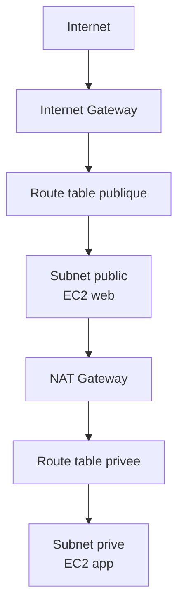

# Chapitre 4 — Théorie : sécurité réseau dans le VPC

> **Objectif du module :** comprendre la **topologie réseau AWS** (VPC, subnets, route tables, IGW, NAT) et les **deux pare-feux** disponibles : Security Groups et NACLs.

---

## Sommaire

1. [Architecture d'un VPC](#vpc)
2. [Subnets publics et privés](#subnets)
3. [Internet Gateway et NAT Gateway](#internet)
4. [Security Groups (SG)](#sg)
5. [Network ACLs (NACL)](#nacl)
6. [SG vs NACL — comparaison](#comparaison)
7. [VPC Endpoints et flux internes](#endpoints)
8. [Réel vs LocalStack — encart](#realmock)
9. [Quiz d'auto-évaluation](#quiz)
10. [Références](#references)

---

<a id="vpc"></a>

## 1. Architecture d'un VPC



| Composant | Rôle |
|---|---|
| **VPC** | Réseau virtuel isolé, plage CIDR (ex. `10.0.0.0/16`) |
| **Subnet** | Sous-réseau dans une AZ (ex. `10.0.1.0/24`) |
| **Route table** | Définit où va le trafic |
| **Internet Gateway (IGW)** | Permet la sortie/entrée Internet |
| **NAT Gateway** | Permet à des ressources privées de sortir vers Internet |
| **Security Group (SG)** | Pare-feu stateful, attaché à l'ENI |
| **NACL** | Pare-feu stateless, attaché au subnet |

---

<a id="subnets"></a>

## 2. Subnets publics et privés

- **Subnet public** : sa route table a une route `0.0.0.0/0 → IGW`. Les ressources peuvent recevoir et émettre du trafic Internet.
- **Subnet privé** : pas de route directe vers l'IGW. Pour sortir, on passe par un **NAT Gateway** placé dans un subnet public.

> **Bonne pratique :** les bases de données et les couches applicatives vont dans des **subnets privés**. Seul le frontal web est dans un subnet public.

---

<a id="internet"></a>

## 3. Internet Gateway et NAT Gateway

| Composant | Direction | Coût AWS réel |
|---|---|---|
| Internet Gateway | bidirectionnel | gratuit |
| NAT Gateway | privé → public (sortant) | facturé (env. 30 $/mois) |

> **Astuce :** pour un cours, on simplifie en ne créant qu'**un IGW** et un subnet public. Le NAT Gateway est mentionné mais pas créé dans le TP 4.

---

<a id="sg"></a>

## 4. Security Groups (SG)

- **Stateful** : si le trafic sortant est autorisé, la réponse entrante est automatiquement autorisée.
- Attachés à l'**ENI** (interface réseau) d'une ressource (EC2, RDS, Lambda…).
- Règles **Allow uniquement** (pas de Deny).
- Évaluation : si **au moins une règle** matche, c'est autorisé.

Exemple :

```hcl
resource "aws_security_group" "web" {
  name        = "web-sg"
  description = "Autorise HTTPS depuis Internet"
  vpc_id      = aws_vpc.main.id

  ingress {
    from_port   = 443
    to_port     = 443
    protocol    = "tcp"
    cidr_blocks = ["0.0.0.0/0"]
  }

  egress {
    from_port   = 0
    to_port     = 0
    protocol    = "-1"
    cidr_blocks = ["0.0.0.0/0"]
  }
}
```

---

<a id="nacl"></a>

## 5. Network ACLs (NACL)

- **Stateless** : il faut autoriser explicitement l'aller ET le retour.
- Attachées au **subnet**.
- Règles ordonnées par **numéro de règle**, première qui matche gagne.
- Supportent **Allow ET Deny**.

Exemple :

```hcl
resource "aws_network_acl" "private" {
  vpc_id     = aws_vpc.main.id
  subnet_ids = [aws_subnet.private.id]

  ingress {
    rule_no    = 100
    protocol   = "tcp"
    action     = "allow"
    cidr_block = "10.0.0.0/16"
    from_port  = 0
    to_port    = 65535
  }

  egress {
    rule_no    = 100
    protocol   = "-1"
    action     = "allow"
    cidr_block = "0.0.0.0/0"
    from_port  = 0
    to_port    = 0
  }
}
```

---

<a id="comparaison"></a>

## 6. SG vs NACL — comparaison

| Critère | Security Group | NACL |
|---|---|---|
| Niveau | ENI (ressource) | Subnet |
| État | **Stateful** | **Stateless** |
| Allow/Deny | Allow seulement | Allow et Deny |
| Évaluation | OR (au moins une règle matche) | Ordonnée par `rule_no` |
| Usage | sécurité fine par ressource | filtrage grossier au subnet |

> **Astuce :** dans 95 % des cas, le SG suffit. Le NACL ajoute une couche de défense en profondeur, surtout pour bloquer des IP ou des plages CIDR.

---

<a id="endpoints"></a>

## 7. VPC Endpoints et flux internes

Pour éviter qu'un appel à S3 ou DynamoDB depuis votre VPC ne sorte sur Internet, vous pouvez créer un **VPC Endpoint** :

- **Gateway endpoint** : S3, DynamoDB (gratuit).
- **Interface endpoint** (PrivateLink) : SQS, SNS, KMS, Secrets Manager, etc. (payant).

Avantages :

- pas de sortie Internet,
- traçabilité fine,
- réduction des coûts NAT.

> **Hors cours pratique :** non émulé fidèlement en LocalStack ; mentionné en théorie seulement.

---

<a id="realmock"></a>

## 8. Réel vs LocalStack — encart

> **Mock vs réel — réseau :**  
> LocalStack accepte la création de VPC, subnets, route tables, SG, NACLs. **Aucun filtrage réseau n'est appliqué.**  
> Vous apprenez l'IaC : à écrire un VPC correctement, avec les bonnes règles SG/NACL.  
> Vous **n'apprenez pas** l'effet d'un blocage réel. Pour cela, il faut un compte AWS sandbox ou des outils comme `tflint`, `checkov`, `tfsec` pour scanner statiquement le code.

---

<a id="quiz"></a>

## 9. Quiz d'auto-évaluation

1. Un Security Group est-il **stateful** ou **stateless** ?
2. Un NACL est-il attaché à un **subnet** ou à une **ENI** ?
3. Combien de SGs peut-on attacher à une seule ENI EC2 ?
4. Quelle ressource permet à un subnet **privé** de sortir vers Internet ?
5. Citer un avantage d'un **VPC endpoint** S3.

> Réponses : 1. Stateful. 2. Subnet. 3. Plusieurs (jusqu'à 5 par défaut). 4. NAT Gateway. 5. Trafic ne sort pas du VPC vers Internet.

---

<a id="references"></a>

## 10. Références

- AWS — VPC User Guide : https://docs.aws.amazon.com/vpc/latest/userguide/
- AWS — Security Groups : https://docs.aws.amazon.com/vpc/latest/userguide/VPC_SecurityGroups.html
- AWS — Network ACLs : https://docs.aws.amazon.com/vpc/latest/userguide/vpc-network-acls.html
- AWS — VPC Endpoints : https://docs.aws.amazon.com/vpc/latest/privatelink/vpc-endpoints.html

---

⬅ Précédent : [`03b-Chapitre3-Pratique-iam-users-groups-roles-policies.md`](03b-Chapitre3-Pratique-iam-users-groups-roles-policies.md)  
➡ Pratique : [`04b-Chapitre4-Pratique-vpc-sg-nacl-iac.md`](04b-Chapitre4-Pratique-vpc-sg-nacl-iac.md)
