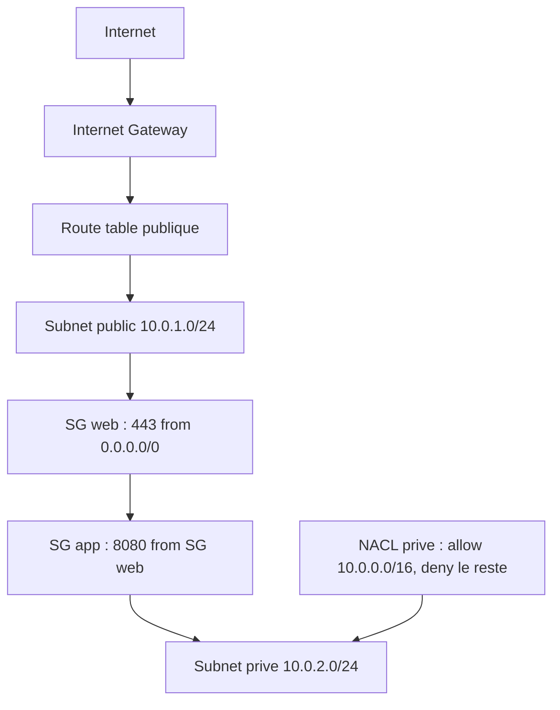

<a id="top"></a>

# Chapitre 4 — Pratique : VPC + Security Groups + NACL (IaC)

> **Module concerné :** M4 — Infrastructure security.
>
> **Théorie associée :** [`04a-Chapitre4-Theorie-vpc-securite.md`](04a-Chapitre4-Theorie-vpc-securite.md)
>
> **Solution exécutable :** [`solutions/tp4b/`](solutions/tp4b/)
>
> **Durée estimée :** 90 minutes.

---

> **Mock vs réel — réseau :** LocalStack accepte la **création** des ressources réseau (VPC, subnets, SG, NACL) mais **n'effectue aucun filtrage**. Ce TP enseigne la **conception IaC** d'un réseau AWS sécurisé. Pour tester l'effet réel, il faut un compte AWS ou des scanners statiques (`tflint`, `checkov`, `tfsec`).

---

## Sommaire

- [Objectifs](#objectifs)
- [Prérequis](#prerequis)
- [Architecture cible](#archi)
- [Plan du TP (parties I à XII)](#plan)
- [Partie I — Démarrage](#part1)
- [Partie II — Le VPC](#part2)
- [Partie III — Subnets public et privé](#part3)
- [Partie IV — Internet Gateway et route table publique](#part4)
- [Partie V — Route table privée](#part5)
- [Partie VI — Security Group `web`](#part6)
- [Partie VII — Security Group `app` (réf. SG dans SG)](#part7)
- [Partie VIII — Network ACL privé](#part8)
- [Partie IX — `terraform apply` et validations CLI](#part9)
- [Partie X — Scanner le code avec `tflint`/`checkov` (optionnel)](#part10)
- [Partie XI — Mini-rapport](#part11)
- [Partie XII — Nettoyage](#part12)
- [Barème](#bareme)
- [Corrigé minimal](#corrige)
- [Références](#references)

---

<a id="objectifs"></a>

## Objectifs

À la fin de ce TP, vous saurez :

- créer un **VPC** avec **subnets publics et privés**,
- relier le subnet public à un **Internet Gateway** via une **route table**,
- écrire des **Security Groups** avec règles entrantes/sortantes,
- référencer un **SG dans un autre SG** (SG-to-SG),
- créer un **Network ACL** avec règles allow/deny ordonnées.

---

<a id="prerequis"></a>

## Prérequis

- Docker Desktop démarré.
- `LOCALSTACK_AUTH_TOKEN` valide.
- Avoir lu [`04a`](04a-Chapitre4-Theorie-vpc-securite.md).

---

<a id="archi"></a>

## Architecture cible



| Ressource | Rôle |
|---|---|
| VPC `10.0.0.0/16` | Réseau principal |
| Subnet public `10.0.1.0/24` | Tier web |
| Subnet privé `10.0.2.0/24` | Tier app |
| IGW | Sortie/entrée Internet |
| SG `web` | Autorise 443 depuis Internet |
| SG `app` | Autorise 8080 uniquement depuis SG `web` |
| NACL privé | Allow VPC interne, deny le reste |

---

<a id="plan"></a>

## Plan du TP (parties I à XII)

| Partie | Sujet |
|---:|---|
| I | Démarrage |
| II | VPC |
| III | Subnets |
| IV | IGW + route publique |
| V | Route privée |
| VI | SG web |
| VII | SG app (SG-to-SG) |
| VIII | NACL privé |
| IX | apply + CLI |
| X | Scan statique (optionnel) |
| XI | Mini-rapport |
| XII | Nettoyage |

---

<a id="part1"></a>

## Partie I — Démarrage

```bash
cd aws-security-with-localstack/solutions/tp4b
cp .env.example .env
# Editer .env avec votre LOCALSTACK_AUTH_TOKEN
docker compose build
docker compose up -d localstack tools
docker compose run --rm tools terraform -chdir=terraform init
```

---

<a id="part2"></a>

## Partie II — Le VPC

```hcl
resource "aws_vpc" "main" {
  cidr_block           = var.vpc_cidr
  enable_dns_support   = true
  enable_dns_hostnames = true
  tags = {
    Name    = "${var.project}-vpc"
    Project = var.project
  }
}
```

> **Astuce :** `enable_dns_hostnames = true` est nécessaire pour que les ressources reçoivent un nom DNS.

---

<a id="part3"></a>

## Partie III — Subnets public et privé

```hcl
resource "aws_subnet" "public" {
  vpc_id                  = aws_vpc.main.id
  cidr_block              = var.public_subnet_cidr
  availability_zone       = var.az
  map_public_ip_on_launch = true
  tags = { Name = "${var.project}-public-subnet", Tier = "public" }
}

resource "aws_subnet" "private" {
  vpc_id            = aws_vpc.main.id
  cidr_block        = var.private_subnet_cidr
  availability_zone = var.az
  tags = { Name = "${var.project}-private-subnet", Tier = "private" }
}
```

> **Pourquoi ?** Le subnet public a `map_public_ip_on_launch = true`. Le privé, non.

---

<a id="part4"></a>

## Partie IV — Internet Gateway et route table publique

```hcl
resource "aws_internet_gateway" "main" {
  vpc_id = aws_vpc.main.id
}

resource "aws_route_table" "public" {
  vpc_id = aws_vpc.main.id
  route {
    cidr_block = "0.0.0.0/0"
    gateway_id = aws_internet_gateway.main.id
  }
}

resource "aws_route_table_association" "public" {
  subnet_id      = aws_subnet.public.id
  route_table_id = aws_route_table.public.id
}
```

---

<a id="part5"></a>

## Partie V — Route table privée

```hcl
resource "aws_route_table" "private" {
  vpc_id = aws_vpc.main.id
}

resource "aws_route_table_association" "private" {
  subnet_id      = aws_subnet.private.id
  route_table_id = aws_route_table.private.id
}
```

> **Pourquoi pas de route vers `0.0.0.0/0` ?** En production, on ajouterait une route vers un **NAT Gateway**. Ici, pour le coût et la pédagogie, on s'arrête à un subnet privé strict.

---

<a id="part6"></a>

## Partie VI — Security Group `web`

```hcl
resource "aws_security_group" "web" {
  name        = "${var.project}-web-sg"
  description = "Autorise HTTPS entrant depuis Internet."
  vpc_id      = aws_vpc.main.id

  ingress {
    from_port   = 443
    to_port     = 443
    protocol    = "tcp"
    cidr_blocks = ["0.0.0.0/0"]
  }

  egress {
    from_port   = 0
    to_port     = 0
    protocol    = "-1"
    cidr_blocks = ["0.0.0.0/0"]
  }
}
```

> **Astuce :** un SG est **stateful** : la réponse à un flux sortant autorisé est automatiquement laissée passer.

---

<a id="part7"></a>

## Partie VII — Security Group `app` (SG-to-SG)

```hcl
resource "aws_security_group" "app" {
  name        = "${var.project}-app-sg"
  description = "Autorise 8080 uniquement depuis le SG web."
  vpc_id      = aws_vpc.main.id

  ingress {
    from_port       = 8080
    to_port         = 8080
    protocol        = "tcp"
    security_groups = [aws_security_group.web.id]
  }

  egress {
    from_port   = 0
    to_port     = 0
    protocol    = "-1"
    cidr_blocks = ["0.0.0.0/0"]
  }
}
```

> **Pourquoi `security_groups` et pas `cidr_blocks` ?** Cela autorise uniquement les ressources attachées au SG `web`, indépendamment de leur IP. C'est plus fin et plus stable.

---

<a id="part8"></a>

## Partie VIII — Network ACL privé

```hcl
resource "aws_network_acl" "private" {
  vpc_id     = aws_vpc.main.id
  subnet_ids = [aws_subnet.private.id]

  ingress {
    rule_no    = 100
    protocol   = "tcp"
    action     = "allow"
    cidr_block = var.vpc_cidr
    from_port  = 0
    to_port    = 65535
  }

  ingress {
    rule_no    = 200
    protocol   = "-1"
    action     = "deny"
    cidr_block = "0.0.0.0/0"
    from_port  = 0
    to_port    = 0
  }

  egress {
    rule_no    = 100
    protocol   = "-1"
    action     = "allow"
    cidr_block = "0.0.0.0/0"
    from_port  = 0
    to_port    = 0
  }
}
```

> **Astuce :** les règles NACL sont **stateless**. Il faut écrire l'aller ET le retour. Numéros bas évalués en premier.

---

<a id="part9"></a>

## Partie IX — `terraform apply` et validations CLI

```bash
docker compose run --rm tools terraform -chdir=terraform plan
docker compose run --rm tools terraform -chdir=terraform apply -auto-approve

docker compose run --rm tools aws --endpoint-url=http://localstack:4566 ec2 describe-vpcs
docker compose run --rm tools aws --endpoint-url=http://localstack:4566 ec2 describe-subnets
docker compose run --rm tools aws --endpoint-url=http://localstack:4566 ec2 describe-security-groups
docker compose run --rm tools aws --endpoint-url=http://localstack:4566 ec2 describe-network-acls
```

---

<a id="part10"></a>

## Partie X — Scanner le code avec `tflint`/`checkov` (optionnel)

> **Pourquoi ?** Puisque LocalStack ne valide pas l'effet réel, **scannez votre code** avec un outil d'analyse statique. C'est ce qu'on fait en production.

Exemples (hors conteneur) :

```bash
pip install checkov
checkov -d aws-security-with-localstack/solutions/tp4b/terraform
```

> Vous découvrirez probablement des recommandations (ex. `0.0.0.0/0 sur port 443` est large mais acceptable pour un endpoint public).

---

<a id="part11"></a>

## Partie XI — Mini-rapport

1. Quelle est la différence concrète entre **SG** et **NACL** ?
2. Pourquoi référencer un SG dans un autre SG plutôt qu'un CIDR ?
3. Quelles règles écririez-vous pour autoriser SSH (port 22) **uniquement depuis votre IP** ?
4. Quel risque y a-t-il à mettre `0.0.0.0/0` sur le port 22 ?
5. Que faut-il ajouter pour qu'une ressource du subnet privé puisse sortir vers Internet ?

---

<a id="part12"></a>

## Partie XII — Nettoyage

```bash
docker compose run --rm tools terraform -chdir=terraform destroy -auto-approve
docker compose down -v
```

---

<a id="bareme"></a>

## Barème (40 points)

| Partie | Points |
|---:|---:|
| I — démarrage | 2 |
| II — VPC | 3 |
| III — subnets | 4 |
| IV — IGW + route publique | 5 |
| V — route privée | 3 |
| VI — SG web | 5 |
| VII — SG app (SG-to-SG) | 6 |
| VIII — NACL | 6 |
| IX — apply + CLI | 3 |
| XI — mini-rapport | 3 |
| **Total** | **40** |

---

<a id="corrige"></a>

## Corrigé minimal

Voir [`solutions/tp4b/`](solutions/tp4b/).

```bash
docker compose run --rm tools aws --endpoint-url=http://localstack:4566 ec2 describe-vpcs \
  | jq '.Vpcs[].CidrBlock'
# attendu: "10.0.0.0/16"

docker compose run --rm tools aws --endpoint-url=http://localstack:4566 ec2 describe-security-groups \
  | jq '.SecurityGroups[].GroupName'
# attendu: secdemo-web-sg, secdemo-app-sg, default
```

---

<a id="references"></a>

## Références

- AWS — VPC User Guide : https://docs.aws.amazon.com/vpc/latest/userguide/
- AWS — Security Groups : https://docs.aws.amazon.com/vpc/latest/userguide/VPC_SecurityGroups.html
- AWS — Network ACLs : https://docs.aws.amazon.com/vpc/latest/userguide/vpc-network-acls.html
- Checkov : https://www.checkov.io/
- tflint : https://github.com/terraform-linters/tflint

---

⬅ [`04a-Chapitre4-Theorie-vpc-securite.md`](04a-Chapitre4-Theorie-vpc-securite.md) | 🏠 [`README.md`](README.md) | ➡ [`05a-Chapitre5-Theorie-protection-donnees.md`](05a-Chapitre5-Theorie-protection-donnees.md)

<p align="right"><a href="#top">↑ Retour en haut</a></p>
