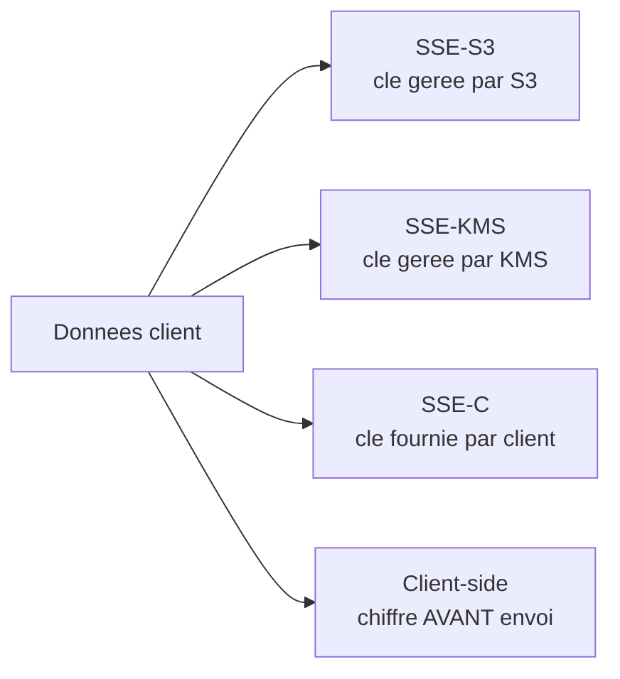
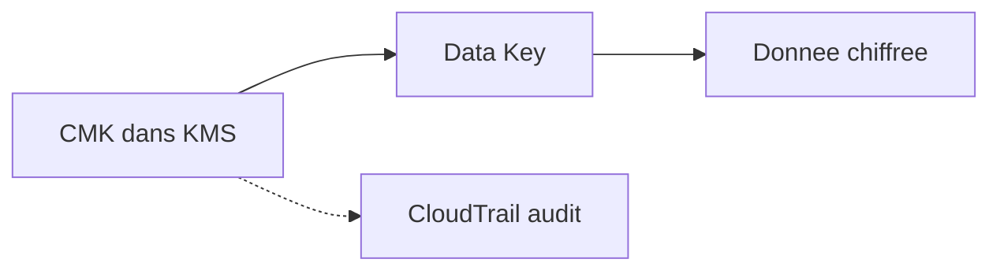

# Chapitre 5 — Théorie : protection des données

> **Objectif du module :** comprendre les **options de chiffrement** AWS (SSE-S3, SSE-KMS, SSE-C, client-side), le rôle de **KMS** et les contrôles spécifiques à **S3** pour empêcher les fuites de données.

---

## Sommaire

1. [Pourquoi protéger les données ?](#pourquoi)
2. [Chiffrement au repos vs en transit](#repos-transit)
3. [Les types de chiffrement S3](#sse)
4. [KMS — concepts essentiels](#kms)
5. [Sécurité du bucket S3 — checklist](#s3-checklist)
6. [Versioning et MFA Delete](#versioning)
7. [Bucket policies et public access block](#policies)
8. [Secrets Manager](#secrets)
9. [Réel vs LocalStack — encart](#realmock)
10. [Quiz d'auto-évaluation](#quiz)
11. [Références](#references)

---

<a id="pourquoi"></a>

## 1. Pourquoi protéger les données ?

| Risque | Conséquence |
|---|---|
| Bucket S3 public | Fuite massive de données clients |
| Disque non chiffré | Données lisibles en cas de vol physique |
| Mot de passe en clair dans le code | Compromission instantanée |
| Pas de versioning | Suppression accidentelle irréversible |

La **protection des données** combine plusieurs leviers : chiffrement, contrôle d'accès, versioning, journalisation, classification.

---

<a id="repos-transit"></a>

## 2. Chiffrement au repos vs en transit

| Type | Quand | Outil AWS |
|---|---|---|
| **Au repos** (at rest) | données stockées sur disque | SSE-S3, SSE-KMS, EBS encryption, RDS encryption |
| **En transit** (in transit) | données qui circulent | TLS partout (HTTPS, AWS APIs forcent TLS) |

> **Bonne pratique :** activer **les deux** systématiquement. AWS facilite : TLS est par défaut, le chiffrement at rest est une case à cocher.

---

<a id="sse"></a>

## 3. Les types de chiffrement S3



| Mode | Clé | Audit dans CloudTrail ? | Usage |
|---|---|---|---|
| **SSE-S3** (AES-256) | gérée par S3 | non | minimum vital, gratuit |
| **SSE-KMS** | gérée par KMS (CMK) | oui | par défaut **recommandé** |
| **SSE-C** | fournie par le client | non | usage rare |
| **Client-side** | client | non visible AWS | données très sensibles |

> **Recommandation cours :** **SSE-KMS** avec une **clé client (CMK)** pour bénéficier de l'audit et de la rotation.

---

<a id="kms"></a>

## 4. KMS — concepts essentiels

| Terme | Définition |
|---|---|
| **CMK** | Customer Master Key, la clé racine |
| **Data Key** | clé symétrique courte durée, dérivée de la CMK |
| **Envelope encryption** | la donnée est chiffrée avec une data key, la data key est chiffrée avec la CMK |
| **Key policy** | policy attachée à la CMK, complète IAM |
| **Grants** | délégation temporaire de permissions sur la clé |
| **Rotation** | annuelle automatique pour les CMK AWS-managed et customer-managed |



> **Astuce :** vous ne **manipulez jamais directement** la CMK pour chiffrer 1 Go de données. Vous demandez une **data key**, vous l'utilisez localement, et vous stockez le blob chiffré avec la donnée.

---

<a id="s3-checklist"></a>

## 5. Sécurité du bucket S3 — checklist

| Contrôle | Quoi |
|---|---|
| **Public access block** | bloque toute exposition publique (4 cases à cocher) |
| **Bucket policy** | autorise/refuse explicitement |
| **Versioning** | active la conservation des versions |
| **MFA Delete** | exige une MFA pour supprimer les versions |
| **SSE** | chiffrement SSE-KMS recommandé |
| **Logging** | accès loggués dans un autre bucket |
| **Lifecycle** | transition Glacier, expiration |
| **Tags** | classification, propriété |

---

<a id="versioning"></a>

## 6. Versioning et MFA Delete

- **Versioning ON** : chaque PUT crée une nouvelle version, la suppression crée une **delete marker** sans perdre la donnée.
- **MFA Delete** : seul l'utilisateur root avec MFA peut supprimer une version définitivement.

> **Réel vs LocalStack :** MFA Delete **non émulé** ; le versioning lui-même fonctionne très bien.

---

<a id="policies"></a>

## 7. Bucket policies et public access block

Bucket policy minimale qui **refuse les requêtes non chiffrées** :

```json
{
  "Version": "2012-10-17",
  "Statement": [
    {
      "Sid": "DenyUnencryptedTransport",
      "Effect": "Deny",
      "Principal": "*",
      "Action": "s3:*",
      "Resource": [
        "arn:aws:s3:::my-bucket",
        "arn:aws:s3:::my-bucket/*"
      ],
      "Condition": {
        "Bool": { "aws:SecureTransport": "false" }
      }
    }
  ]
}
```

Public access block (les 4 cases à cocher) :

| Option | Effet |
|---|---|
| `BlockPublicAcls` | refuse les ACL publics |
| `IgnorePublicAcls` | ignore les ACL publics existants |
| `BlockPublicPolicy` | refuse les bucket policies publiques |
| `RestrictPublicBuckets` | restreint l'accès à un bucket déjà public |

> **Bonne pratique :** les 4 à **true** par défaut, sur tous les buckets.

---

<a id="secrets"></a>

## 8. Secrets Manager

Pour les **mots de passe**, **clés API**, **tokens** :

- ne pas committer dans Git,
- ne pas mettre dans `.env` versionné,
- stocker dans **Secrets Manager** ou **Parameter Store**, chiffré avec **KMS**.
- récupérer via `boto3.client("secretsmanager").get_secret_value(...)`.

Mentionné dans le TP 5 mais non central.

---

<a id="realmock"></a>

## 9. Réel vs LocalStack — encart

> **Mock vs réel — S3 / KMS :**  
> S3 est très bien émulé : versioning, public access block, policies, encryption fonctionnent.  
> KMS encrypt / decrypt / GenerateDataKey fonctionnent. Les clés restent **locales** à votre LocalStack.  
> La **rotation automatique** annuelle des clés et certains événements **CloudTrail KMS** ne sont pas émulés.

---

<a id="quiz"></a>

## 10. Quiz d'auto-évaluation

1. Quelle différence entre **SSE-S3** et **SSE-KMS** ?
2. Que signifie « envelope encryption » ?
3. Quel mécanisme S3 garantit qu'aucun bucket policy public ne sera autorisé ?
4. Pourquoi `aws:SecureTransport=false` est-il refusé ?
5. Où ranger un mot de passe d'application ?

> Réponses : 1. SSE-S3 = clé gérée par S3, sans audit ; SSE-KMS = clé KMS, audit CloudTrail. 2. La donnée est chiffrée par une data key, la data key est chiffrée par la CMK. 3. `BlockPublicPolicy` + `RestrictPublicBuckets`. 4. Pour refuser les requêtes HTTP non chiffrées. 5. Secrets Manager ou Parameter Store, jamais en clair dans le repo.

---

<a id="references"></a>

## 11. Références

- AWS — S3 Security Best Practices : https://docs.aws.amazon.com/AmazonS3/latest/userguide/security-best-practices.html
- AWS — KMS Concepts : https://docs.aws.amazon.com/kms/latest/developerguide/concepts.html
- AWS — S3 Public Access Block : https://docs.aws.amazon.com/AmazonS3/latest/userguide/access-control-block-public-access.html
- AWS — Secrets Manager : https://docs.aws.amazon.com/secretsmanager/

---

⬅ Précédent : [`04b-Chapitre4-Pratique-vpc-sg-nacl-iac.md`](04b-Chapitre4-Pratique-vpc-sg-nacl-iac.md)  
➡ Pratique : [`05b-Chapitre5-Pratique-s3-hardening-kms.md`](05b-Chapitre5-Pratique-s3-hardening-kms.md)
