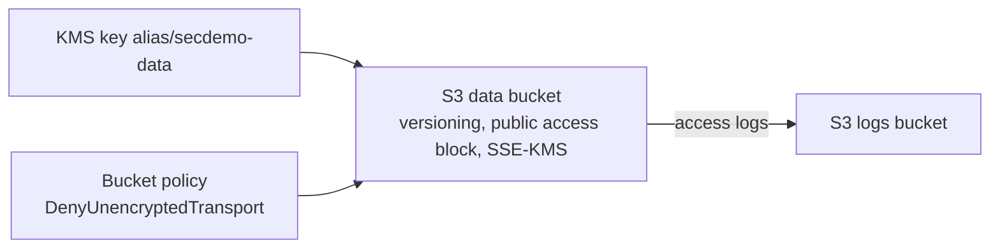

<a id="top"></a>

# Chapitre 5 — Pratique : S3 hardening + KMS

> **Module concerné :** M5 — Data protection.
>
> **Théorie associée :** [`05a-Chapitre5-Theorie-protection-donnees.md`](05a-Chapitre5-Theorie-protection-donnees.md)
>
> **Solution exécutable :** [`solutions/tp5b/`](solutions/tp5b/)
>
> **Durée estimée :** 90 minutes.

---

> **Mock vs réel — S3/KMS :** S3 (versioning, public access block, SSE-KMS, bucket policy, logging) et KMS (encrypt, decrypt, generate data key) sont bien émulés. La **rotation automatique** des clés et certains événements CloudTrail KMS ne sont pas reproduits.

---

## Sommaire

- [Objectifs](#objectifs)
- [Prérequis](#prerequis)
- [Architecture cible](#archi)
- [Plan du TP (parties I à XIV)](#plan)
- [Partie I — Démarrage](#part1)
- [Partie II — Créer la clé KMS et son alias](#part2)
- [Partie III — Créer le bucket de logs durci](#part3)
- [Partie IV — Créer le bucket de données](#part4)
- [Partie V — Activer le versioning](#part5)
- [Partie VI — Public Access Block (les 4 cases)](#part6)
- [Partie VII — Activer SSE-KMS](#part7)
- [Partie VIII — Activer le logging vers `logs`](#part8)
- [Partie IX — Bucket policy `DenyUnencryptedTransport`](#part9)
- [Partie X — `terraform apply` et validations CLI](#part10)
- [Partie XI — Envelope encryption avec `boto3`](#part11)
- [Partie XII — Tester la suppression et la récupération de versions](#part12)
- [Partie XIII — Mini-rapport](#part13)
- [Partie XIV — Nettoyage](#part14)
- [Barème](#bareme)
- [Corrigé minimal](#corrige)
- [Références](#references)

---

<a id="objectifs"></a>

## Objectifs

À la fin de ce TP, vous saurez :

- créer une **clé KMS** avec rotation et alias,
- durcir un bucket S3 (versioning, public access block, SSE-KMS, bucket policy),
- activer le **logging** d'accès vers un bucket dédié,
- refuser tout transport non chiffré via `aws:SecureTransport`,
- utiliser KMS pour faire de l'**envelope encryption** avec `boto3`.

---

<a id="prerequis"></a>

## Prérequis

- Docker Desktop démarré.
- `LOCALSTACK_AUTH_TOKEN` valide.
- Avoir lu [`05a`](05a-Chapitre5-Theorie-protection-donnees.md).

---

<a id="archi"></a>

## Architecture cible



---

<a id="plan"></a>

## Plan du TP (parties I à XIV)

| Partie | Sujet |
|---:|---|
| I | Démarrage |
| II | Clé KMS et alias |
| III | Bucket de logs durci |
| IV | Bucket de données |
| V | Versioning |
| VI | Public Access Block |
| VII | SSE-KMS |
| VIII | Logging vers bucket logs |
| IX | Bucket policy SecureTransport |
| X | apply + CLI |
| XI | Envelope encryption boto3 |
| XII | Test versioning |
| XIII | Mini-rapport |
| XIV | Nettoyage |

---

<a id="part1"></a>

## Partie I — Démarrage

```bash
cd aws-security-with-localstack/solutions/tp5b
cp .env.example .env
docker compose build
docker compose up -d localstack tools
docker compose run --rm tools terraform -chdir=terraform init
```

---

<a id="part2"></a>

## Partie II — Créer la clé KMS et son alias

```hcl
resource "aws_kms_key" "data" {
  description             = "${var.project} - cle de chiffrement du bucket data"
  deletion_window_in_days = 7
  enable_key_rotation     = true
}

resource "aws_kms_alias" "data" {
  name          = "alias/${var.project}-data"
  target_key_id = aws_kms_key.data.key_id
}
```

> **Astuce :** toujours utiliser un **alias** dans le code applicatif plutôt qu'un `key_id` qui peut changer.

---

<a id="part3"></a>

## Partie III — Créer le bucket de logs durci

```hcl
resource "aws_s3_bucket" "logs" {
  bucket = var.logs_bucket_name
}

resource "aws_s3_bucket_versioning" "logs" {
  bucket = aws_s3_bucket.logs.id
  versioning_configuration { status = "Enabled" }
}

resource "aws_s3_bucket_public_access_block" "logs" {
  bucket                  = aws_s3_bucket.logs.id
  block_public_acls       = true
  block_public_policy     = true
  ignore_public_acls      = true
  restrict_public_buckets = true
}
```

> **Pourquoi un bucket de logs séparé ?** Le bucket recevant les access logs ne doit pas se logguer lui-même (boucle infinie).

---

<a id="part4"></a>

## Partie IV — Créer le bucket de données

```hcl
resource "aws_s3_bucket" "data" {
  bucket = var.data_bucket_name

  tags = {
    Sensitivity = "high"
    DataClass   = "confidential"
  }
}
```

> **Astuce :** les **tags** servent à la classification et au coût. Toujours étiqueter.

---

<a id="part5"></a>

## Partie V — Activer le versioning

```hcl
resource "aws_s3_bucket_versioning" "data" {
  bucket = aws_s3_bucket.data.id
  versioning_configuration { status = "Enabled" }
}
```

> **Pourquoi ?** Conserver les versions précédentes d'un objet protège contre la suppression accidentelle ou malveillante.

---

<a id="part6"></a>

## Partie VI — Public Access Block (les 4 cases)

```hcl
resource "aws_s3_bucket_public_access_block" "data" {
  bucket                  = aws_s3_bucket.data.id
  block_public_acls       = true
  block_public_policy     = true
  ignore_public_acls      = true
  restrict_public_buckets = true
}
```

> **Pourquoi les 4 ?** Chaque option couvre un canal de fuite différent (ACL, policy, héritage). Activer les 4 est la **règle d'or** sécurité S3.

---

<a id="part7"></a>

## Partie VII — Activer SSE-KMS

```hcl
resource "aws_s3_bucket_server_side_encryption_configuration" "data" {
  bucket = aws_s3_bucket.data.id

  rule {
    apply_server_side_encryption_by_default {
      sse_algorithm     = "aws:kms"
      kms_master_key_id = aws_kms_key.data.arn
    }
    bucket_key_enabled = true
  }
}
```

> **Pourquoi `bucket_key_enabled = true` ?** Sur AWS réel, cela réduit le coût KMS en mutualisant la dérivation. Sans effet de coût en LocalStack mais bonne habitude.

---

<a id="part8"></a>

## Partie VIII — Activer le logging vers `logs`

```hcl
resource "aws_s3_bucket_logging" "data" {
  bucket        = aws_s3_bucket.data.id
  target_bucket = aws_s3_bucket.logs.id
  target_prefix = "data-bucket/"
}
```

> **Pourquoi ?** Tracer les accès au bucket. Indispensable en cas d'incident.

---

<a id="part9"></a>

## Partie IX — Bucket policy `DenyUnencryptedTransport`

```hcl
data "aws_iam_policy_document" "data_secure_transport" {
  statement {
    sid     = "DenyUnencryptedTransport"
    effect  = "Deny"
    principals {
      type        = "*"
      identifiers = ["*"]
    }
    actions   = ["s3:*"]
    resources = [
      aws_s3_bucket.data.arn,
      "${aws_s3_bucket.data.arn}/*",
    ]
    condition {
      test     = "Bool"
      variable = "aws:SecureTransport"
      values   = ["false"]
    }
  }
}

resource "aws_s3_bucket_policy" "data" {
  bucket = aws_s3_bucket.data.id
  policy = data.aws_iam_policy_document.data_secure_transport.json
}
```

---

<a id="part10"></a>

## Partie X — `terraform apply` et validations CLI

```bash
docker compose run --rm tools terraform -chdir=terraform apply -auto-approve

docker compose run --rm tools aws --endpoint-url=http://localstack:4566 s3 ls
docker compose run --rm tools aws --endpoint-url=http://localstack:4566 s3api get-bucket-versioning --bucket secdemo-data-bucket
docker compose run --rm tools aws --endpoint-url=http://localstack:4566 s3api get-public-access-block --bucket secdemo-data-bucket
docker compose run --rm tools aws --endpoint-url=http://localstack:4566 s3api get-bucket-encryption --bucket secdemo-data-bucket
docker compose run --rm tools aws --endpoint-url=http://localstack:4566 s3api get-bucket-policy --bucket secdemo-data-bucket
docker compose run --rm tools aws --endpoint-url=http://localstack:4566 s3api get-bucket-logging --bucket secdemo-data-bucket
docker compose run --rm tools aws --endpoint-url=http://localstack:4566 kms list-aliases
```

---

<a id="part11"></a>

## Partie XI — Envelope encryption avec `boto3`

```bash
docker compose run --rm tools python -c "
import boto3, os, base64
kms = boto3.client('kms', endpoint_url=os.environ['LOCALSTACK_ENDPOINT'])
alias = 'alias/secdemo-data'

# Generate data key
dk = kms.generate_data_key(KeyId=alias, KeySpec='AES_256')
print('CiphertextBlob (b64):', base64.b64encode(dk['CiphertextBlob']).decode()[:40], '...')
print('Plaintext key len:', len(dk['Plaintext']))

# Round-trip decrypt
back = kms.decrypt(CiphertextBlob=dk['CiphertextBlob'])
print('Round-trip OK:', back['Plaintext'] == dk['Plaintext'])
"
```

> **Pourquoi `generate_data_key` ?** On chiffre la donnée localement avec la clé claire **éphémère**, et on stocke le `CiphertextBlob` à côté. C'est l'**envelope encryption**.

---

<a id="part12"></a>

## Partie XII — Tester la suppression et la récupération de versions

```bash
docker compose run --rm tools bash -lc "echo 'donnee v1' > /tmp/file.txt && aws --endpoint-url=http://localstack:4566 s3 cp /tmp/file.txt s3://secdemo-data-bucket/file.txt"
docker compose run --rm tools bash -lc "echo 'donnee v2' > /tmp/file.txt && aws --endpoint-url=http://localstack:4566 s3 cp /tmp/file.txt s3://secdemo-data-bucket/file.txt"
docker compose run --rm tools aws --endpoint-url=http://localstack:4566 s3api list-object-versions --bucket secdemo-data-bucket --prefix file.txt
docker compose run --rm tools aws --endpoint-url=http://localstack:4566 s3 rm s3://secdemo-data-bucket/file.txt
docker compose run --rm tools aws --endpoint-url=http://localstack:4566 s3api list-object-versions --bucket secdemo-data-bucket --prefix file.txt
```

> **Astuce :** le `s3 rm` n'efface pas la donnée, il ajoute un **delete marker**. On peut restaurer la version précédente.

---

<a id="part13"></a>

## Partie XIII — Mini-rapport

1. Pourquoi 4 cases dans le Public Access Block ?
2. Différence entre **SSE-S3** et **SSE-KMS** ?
3. Pourquoi `aws:SecureTransport=false` est-il refusé ?
4. À quoi sert le **versioning** dans un cas d'incident ?
5. Qu'est-ce que l'**envelope encryption** ?

---

<a id="part14"></a>

## Partie XIV — Nettoyage

```bash
docker compose run --rm tools terraform -chdir=terraform destroy -auto-approve
docker compose down -v
```

---

<a id="bareme"></a>

## Barème (40 points)

| Partie | Points |
|---:|---:|
| I — démarrage | 2 |
| II — KMS | 4 |
| III, IV — buckets | 4 |
| V — versioning | 3 |
| VI — public access block | 4 |
| VII — SSE-KMS | 5 |
| VIII — logging | 3 |
| IX — bucket policy | 5 |
| X — apply + CLI | 4 |
| XI — boto3 envelope | 3 |
| XII — versioning test | 2 |
| XIII — mini-rapport | 1 |
| **Total** | **40** |

---

<a id="corrige"></a>

## Corrigé minimal

Voir [`solutions/tp5b/`](solutions/tp5b/).

---

<a id="references"></a>

## Références

- AWS — S3 Security Best Practices : https://docs.aws.amazon.com/AmazonS3/latest/userguide/security-best-practices.html
- AWS — KMS Concepts : https://docs.aws.amazon.com/kms/latest/developerguide/concepts.html
- AWS — S3 Public Access Block : https://docs.aws.amazon.com/AmazonS3/latest/userguide/access-control-block-public-access.html

---

⬅ [`05a-Chapitre5-Theorie-protection-donnees.md`](05a-Chapitre5-Theorie-protection-donnees.md) | 🏠 [`README.md`](README.md) | ➡ [`06a-Chapitre6-Theorie-logging-monitoring.md`](06a-Chapitre6-Theorie-logging-monitoring.md)

<p align="right"><a href="#top">↑ Retour en haut</a></p>
