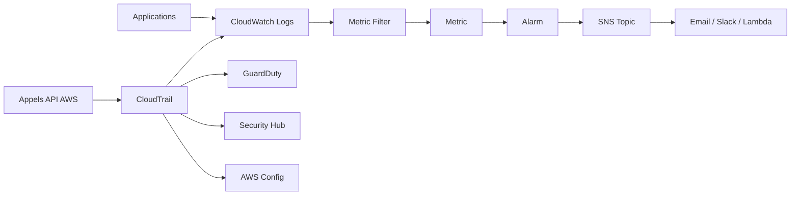

# Chapitre 6 — Théorie : logging et monitoring

> **Objectif du module :** comprendre la **détection** AWS — CloudTrail, CloudWatch (Logs, Metrics, Alarms), AWS Config, GuardDuty, Security Hub — et identifier ce qui est testable dans LocalStack.

---

## Sommaire

1. [Pourquoi logger et monitorer](#pourquoi)
2. [Vue d'ensemble des services AWS](#carto)
3. [CloudTrail](#cloudtrail)
4. [CloudWatch Logs](#logs)
5. [Metric Filters et Alarms](#filters)
6. [AWS Config (théorie)](#config)
7. [GuardDuty (théorie)](#guardduty)
8. [Security Hub (théorie)](#securityhub)
9. [Réel vs LocalStack — encart](#realmock)
10. [Quiz d'auto-évaluation](#quiz)
11. [Références](#references)

---

<a id="pourquoi"></a>

## 1. Pourquoi logger et monitorer

Sans logs, **vous ne savez pas** :

- qui a fait quoi (humain ou service) ?
- quand ?
- depuis quelle IP ?
- avec quel résultat ?

Sans alarmes, **personne n'est prévenu** quand un événement anormal se produit (création d'un user IAM root inattendue, suppression d'un bucket, dépassement de quota).

> **Principe :** activer **CloudTrail** dès le jour 1, et CloudWatch Alarms sur les événements **critiques de sécurité**.

---

<a id="carto"></a>

## 2. Vue d'ensemble des services AWS



| Service | Rôle |
|---|---|
| **CloudTrail** | Journal des appels d'API AWS |
| **CloudWatch Logs** | Logs applicatifs et systèmes |
| **CloudWatch Metrics** | Mesures numériques |
| **CloudWatch Alarms** | Déclenche une action sur seuil |
| **AWS Config** | État et historique des ressources |
| **GuardDuty** | Détection d'anomalies (ML) |
| **Security Hub** | Agrégation de findings |

---

<a id="cloudtrail"></a>

## 3. CloudTrail

- Enregistre les appels **API** (console, CLI, SDK, services AWS).
- Deux niveaux : **Management events** (par défaut) et **Data events** (lecture/écriture S3, Lambda invoke).
- Destination : un bucket S3 (chiffré KMS recommandé) + éventuellement CloudWatch Logs.

> **Hors cours pratique :** CloudTrail dans LocalStack a une couverture partielle. On le mentionne en théorie et on s'en sert pas en TP.

---

<a id="logs"></a>

## 4. CloudWatch Logs

Hiérarchie :

```
Log group
├── Log stream
│   ├── Log event {timestamp, message}
│   └── ...
└── Log stream
```

| Concept | Sens |
|---|---|
| **Log group** | logique d'application, ex. `/aws/lambda/my-fn` |
| **Log stream** | flux d'un container / instance / lambda |
| **Log event** | une ligne de log |
| **Retention** | durée de conservation (jours) |
| **Subscription filter** | redirige les logs vers Lambda, Kinesis… |

Bonnes pratiques :

- définir une **retention** (par défaut « never expire » coûte cher en production AWS),
- structurer les logs en **JSON** pour faciliter les metric filters,
- chiffrer le log group avec KMS pour les données sensibles.

---

<a id="filters"></a>

## 5. Metric Filters et Alarms

Un **metric filter** transforme un motif texte des logs en métrique numérique.

Exemple : compter les `Unauthorized` dans un log group :

```hcl
resource "aws_cloudwatch_log_metric_filter" "unauthorized" {
  name           = "UnauthorizedCount"
  log_group_name = aws_cloudwatch_log_group.app.name
  pattern        = "Unauthorized"

  metric_transformation {
    name      = "UnauthorizedCount"
    namespace = "Security/App"
    value     = "1"
  }
}
```

Et une **alarm** sur cette métrique :

```hcl
resource "aws_cloudwatch_metric_alarm" "many_unauthorized" {
  alarm_name          = "TooManyUnauthorized"
  comparison_operator = "GreaterThanThreshold"
  evaluation_periods  = 1
  metric_name         = "UnauthorizedCount"
  namespace           = "Security/App"
  period              = 60
  statistic           = "Sum"
  threshold           = 5
  treat_missing_data  = "notBreaching"
}
```

> **Astuce :** en production, brancher l'alarme sur un **SNS Topic** qui envoie un email, un message Slack ou déclenche une Lambda d'auto-remédiation.

---

<a id="config"></a>

## 6. AWS Config (théorie)

- Enregistre l'**historique** de configuration de chaque ressource AWS.
- Permet d'écrire des **Config Rules** (ex. « tous les buckets doivent avoir le public access block »).
- Coût significatif en production.
- **Non émulé** en LocalStack gratuit.

---

<a id="guardduty"></a>

## 7. GuardDuty (théorie)

- Service de **threat detection** AWS, basé sur du machine learning.
- Analyse les VPC flow logs, DNS queries, CloudTrail.
- Détecte : comportement anormal, communication avec C2, exfiltration, brute-force.
- **Non émulé** en LocalStack gratuit.

---

<a id="securityhub"></a>

## 8. Security Hub (théorie)

- Agrégateur central des **findings** de sécurité (GuardDuty, Macie, Inspector, AWS Config, 3rd party).
- Évalue les contrôles **CIS AWS Foundations**, **AWS Foundational Security Best Practices**.
- **Non émulé** en LocalStack gratuit.

---

<a id="realmock"></a>

## 9. Réel vs LocalStack — encart

> **Mock vs réel — observabilité :**  
> CloudWatch Logs, metric filters et alarms fonctionnent très bien dans LocalStack : vous pouvez créer un log group, ingérer un log via `aws logs put-log-events`, vérifier qu'un metric filter génère une métrique et qu'une alarm passe en `ALARM`.  
> CloudTrail est **partiel** : utilisable en démo simple, pas fiable pour l'audit.  
> GuardDuty, Config, Security Hub sont **absents** en plan gratuit.

---

<a id="quiz"></a>

## 10. Quiz d'auto-évaluation

1. À quoi sert CloudTrail ?
2. Quelle est la différence entre un **log group** et un **log stream** ?
3. Quel élément Terraform transforme un motif texte en métrique ?
4. Quel service détecte des comportements anormaux par ML ?
5. Pourquoi définir une **retention** sur un log group ?

> Réponses : 1. Journaliser les appels d'API AWS. 2. Group = logique (app), Stream = flux concret (instance). 3. `aws_cloudwatch_log_metric_filter`. 4. GuardDuty. 5. Maîtriser le coût de stockage.

---

<a id="references"></a>

## 11. Références

- AWS — CloudTrail : https://docs.aws.amazon.com/awscloudtrail/
- AWS — CloudWatch : https://docs.aws.amazon.com/AmazonCloudWatch/
- AWS — Config : https://docs.aws.amazon.com/config/
- AWS — GuardDuty : https://docs.aws.amazon.com/guardduty/
- AWS — Security Hub : https://docs.aws.amazon.com/securityhub/

---

⬅ Précédent : [`05b-Chapitre5-Pratique-s3-hardening-kms.md`](05b-Chapitre5-Pratique-s3-hardening-kms.md)  
➡ Pratique : [`06b-Chapitre6-Pratique-cloudwatch-logs-alarms.md`](06b-Chapitre6-Pratique-cloudwatch-logs-alarms.md)
