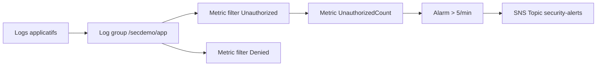

<a id="top"></a>

# Chapitre 6 — Pratique : CloudWatch Logs + Metric Filter + Alarm

> **Module concerné :** M6 — Logging and monitoring.
>
> **Théorie associée :** [`06a-Chapitre6-Theorie-logging-monitoring.md`](06a-Chapitre6-Theorie-logging-monitoring.md)
>
> **Solution exécutable :** [`solutions/tp6b/`](solutions/tp6b/)
>
> **Durée estimée :** 75 minutes.

---

> **Mock vs réel — observabilité :** CloudWatch Logs, metric filters et alarms fonctionnent bien. SNS publie mais n'envoie pas réellement d'email/SMS en local. CloudTrail est partiel et n'est pas utilisé dans ce TP.

---

## Sommaire

- [Objectifs](#objectifs)
- [Prérequis](#prerequis)
- [Architecture cible](#archi)
- [Plan du TP (parties I à XII)](#plan)
- [Partie I — Démarrage](#part1)
- [Partie II — Créer le log group avec rétention](#part2)
- [Partie III — Metric filter `Unauthorized`](#part3)
- [Partie IV — Metric filter `Denied`](#part4)
- [Partie V — SNS topic d'alerte](#part5)
- [Partie VI — Alarm sur le seuil](#part6)
- [Partie VII — `terraform apply`](#part7)
- [Partie VIII — Injecter des logs et déclencher l'alarme](#part8)
- [Partie IX — Inspecter avec `boto3`](#part9)
- [Partie X — Brancher une cible Lambda (vue d'ensemble)](#part10)
- [Partie XI — Mini-rapport](#part11)
- [Partie XII — Nettoyage](#part12)
- [Barème](#bareme)
- [Corrigé minimal](#corrige)
- [Références](#references)

---

<a id="objectifs"></a>

## Objectifs

À la fin de ce TP, vous saurez :

- créer un **log group** CloudWatch avec **rétention**,
- écrire des **metric filters** pour transformer des motifs en métriques,
- créer une **alarm** qui se déclenche sur seuil,
- relier l'alarm à un **topic SNS**,
- déclencher l'alarme en **injectant des logs** factices.

---

<a id="prerequis"></a>

## Prérequis

- Docker Desktop démarré.
- `LOCALSTACK_AUTH_TOKEN` valide.
- Avoir lu [`06a`](06a-Chapitre6-Theorie-logging-monitoring.md).

---

<a id="archi"></a>

## Architecture cible



---

<a id="plan"></a>

## Plan du TP (parties I à XII)

| Partie | Sujet |
|---:|---|
| I | Démarrage |
| II | Log group + retention |
| III | Metric filter Unauthorized |
| IV | Metric filter Denied |
| V | Topic SNS |
| VI | Alarm |
| VII | apply |
| VIII | Injection logs + déclenchement |
| IX | boto3 |
| X | Lambda comme cible (théorie) |
| XI | Mini-rapport |
| XII | Nettoyage |

---

<a id="part1"></a>

## Partie I — Démarrage

```bash
cd aws-security-with-localstack/solutions/tp6b
cp .env.example .env
docker compose build
docker compose up -d localstack tools
docker compose run --rm tools terraform -chdir=terraform init
```

---

<a id="part2"></a>

## Partie II — Créer le log group avec rétention

```hcl
resource "aws_cloudwatch_log_group" "app" {
  name              = "/secdemo/app"
  retention_in_days = var.log_group_retention_days
}
```

> **Pourquoi `retention_in_days` ?** Pour maîtriser le coût AWS réel et respecter les durées de conservation légales.

---

<a id="part3"></a>

## Partie III — Metric filter `Unauthorized`

```hcl
resource "aws_cloudwatch_log_metric_filter" "unauthorized" {
  name           = "${var.project}-unauthorized-count"
  log_group_name = aws_cloudwatch_log_group.app.name
  pattern        = "Unauthorized"

  metric_transformation {
    name      = "UnauthorizedCount"
    namespace = "Security/App"
    value     = "1"
    unit      = "Count"
  }
}
```

> **Astuce :** `pattern` peut être un motif simple ou une expression structurée (JSON, espace, opérateurs). Voir doc AWS CloudWatch filter pattern syntax.

---

<a id="part4"></a>

## Partie IV — Metric filter `Denied`

Identique à `unauthorized`, avec `pattern = "Denied"` et `metric_name = DeniedCount`.

---

<a id="part5"></a>

## Partie V — SNS topic d'alerte

```hcl
resource "aws_sns_topic" "security_alerts" {
  name = "${var.project}-security-alerts"
}
```

> **Pourquoi ?** Un seul topic permet de centraliser les alarmes et d'y abonner plusieurs cibles (email, Slack, Lambda).

---

<a id="part6"></a>

## Partie VI — Alarm sur le seuil

```hcl
resource "aws_cloudwatch_metric_alarm" "too_many_unauthorized" {
  alarm_name          = "${var.project}-too-many-unauthorized"
  comparison_operator = "GreaterThanThreshold"
  evaluation_periods  = 1
  metric_name         = "UnauthorizedCount"
  namespace           = "Security/App"
  period              = 60
  statistic           = "Sum"
  threshold           = var.alarm_threshold_unauthorized
  treat_missing_data  = "notBreaching"
  alarm_actions       = [aws_sns_topic.security_alerts.arn]
  ok_actions          = [aws_sns_topic.security_alerts.arn]
}
```

> **Astuce :** `treat_missing_data = "notBreaching"` évite que l'alarme parte en `INSUFFICIENT_DATA` quand l'application ne loggue rien.

---

<a id="part7"></a>

## Partie VII — `terraform apply`

```bash
docker compose run --rm tools terraform -chdir=terraform apply -auto-approve
docker compose run --rm tools aws --endpoint-url=http://localstack:4566 logs describe-log-groups
docker compose run --rm tools aws --endpoint-url=http://localstack:4566 cloudwatch describe-alarms
```

---

<a id="part8"></a>

## Partie VIII — Injecter des logs et déclencher l'alarme

```bash
docker compose run --rm tools bash -lc '
LSE=http://localstack:4566
LG=/secdemo/app
LS=stream1
aws --endpoint-url=$LSE logs create-log-stream --log-group-name $LG --log-stream-name $LS || true
TS=$(date +%s)000
EVENTS=$(jq -n --arg ts $TS "[
  {timestamp: (\$ts|tonumber), message: \"Unauthorized access from 1.2.3.4\"},
  {timestamp: (\$ts|tonumber), message: \"Unauthorized access from 1.2.3.4\"},
  {timestamp: (\$ts|tonumber), message: \"Unauthorized access from 1.2.3.4\"},
  {timestamp: (\$ts|tonumber), message: \"Unauthorized access from 1.2.3.4\"},
  {timestamp: (\$ts|tonumber), message: \"Unauthorized access from 1.2.3.4\"},
  {timestamp: (\$ts|tonumber), message: \"Unauthorized access from 1.2.3.4\"}
]")
aws --endpoint-url=$LSE logs put-log-events --log-group-name $LG --log-stream-name $LS --log-events "$EVENTS"
'
```

Vérifier la métrique et l'alarme :

```bash
docker compose run --rm tools aws --endpoint-url=http://localstack:4566 cloudwatch get-metric-statistics \
  --namespace Security/App --metric-name UnauthorizedCount --statistics Sum \
  --start-time $(date -u -d '-10 min' +%FT%TZ 2>/dev/null || date -u -v -10M +%FT%TZ) \
  --end-time $(date -u +%FT%TZ) --period 60

docker compose run --rm tools aws --endpoint-url=http://localstack:4566 cloudwatch describe-alarms --alarm-names secdemo-too-many-unauthorized
```

> **Astuce :** sur PowerShell, remplacer la sous-commande `date` par sa version PowerShell.

---

<a id="part9"></a>

## Partie IX — Inspecter avec `boto3`

```bash
docker compose run --rm tools python -c "
import boto3, os
cw  = boto3.client('cloudwatch', endpoint_url=os.environ['LOCALSTACK_ENDPOINT'])
logs = boto3.client('logs',       endpoint_url=os.environ['LOCALSTACK_ENDPOINT'])
print('alarms:')
for a in cw.describe_alarms()['MetricAlarms']:
    print(' ', a['AlarmName'], a['StateValue'])
print('metric filters:')
for f in logs.describe_metric_filters(logGroupName='/secdemo/app')['metricFilters']:
    print(' ', f['filterName'], f['filterPattern'])
"
```

---

<a id="part10"></a>

## Partie X — Brancher une cible Lambda (vue d'ensemble)

En production, on ajoute généralement :

- un **abonnement Lambda** au topic SNS d'alerte,
- ou un **subscription filter** CloudWatch Logs → Lambda pour traiter chaque ligne en temps réel.

Sera couvert dans le TP 7 (incident response).

---

<a id="part11"></a>

## Partie XI — Mini-rapport

1. Qu'apporte un **metric filter** par rapport à un grep manuel sur les logs ?
2. Pourquoi définir une **retention** sur le log group ?
3. Que fait `treat_missing_data = "notBreaching"` ?
4. Pourquoi passer par un **topic SNS** au lieu d'envoyer un email direct depuis l'alarme ?
5. Quelle limite de LocalStack avez-vous observée ?

---

<a id="part12"></a>

## Partie XII — Nettoyage

```bash
docker compose run --rm tools terraform -chdir=terraform destroy -auto-approve
docker compose down -v
```

---

<a id="bareme"></a>

## Barème (40 points)

| Partie | Points |
|---:|---:|
| I — démarrage | 2 |
| II — log group | 4 |
| III — metric filter | 6 |
| IV — autre metric filter | 4 |
| V — SNS | 3 |
| VI — alarm | 7 |
| VII — apply | 3 |
| VIII — injection logs | 6 |
| IX — boto3 | 3 |
| XI — mini-rapport | 2 |
| **Total** | **40** |

---

<a id="corrige"></a>

## Corrigé minimal

Voir [`solutions/tp6b/`](solutions/tp6b/).

---

<a id="references"></a>

## Références

- AWS — CloudWatch Logs : https://docs.aws.amazon.com/AmazonCloudWatch/latest/logs/
- AWS — CloudWatch Alarms : https://docs.aws.amazon.com/AmazonCloudWatch/latest/monitoring/AlarmThatSendsEmail.html
- AWS — Filter Pattern Syntax : https://docs.aws.amazon.com/AmazonCloudWatch/latest/logs/FilterAndPatternSyntax.html
- AWS — SNS : https://docs.aws.amazon.com/sns/

---

⬅ [`06a-Chapitre6-Theorie-logging-monitoring.md`](06a-Chapitre6-Theorie-logging-monitoring.md) | 🏠 [`README.md`](README.md) | ➡ [`07a-Chapitre7-Theorie-incident-response.md`](07a-Chapitre7-Theorie-incident-response.md)

<p align="right"><a href="#top">↑ Retour en haut</a></p>
