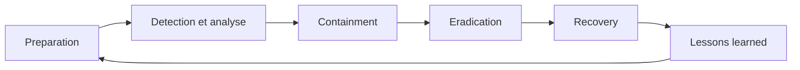

# Chapitre 7 — Théorie : réponse aux incidents

> **Objectif du module :** comprendre les étapes du **NIST Incident Response**, l'outillage AWS, et comment l'automatiser avec **Lambda + EventBridge**.

---

## Sommaire

1. [Qu'est-ce qu'un incident de sécurité ?](#incident)
2. [Le cycle NIST SP 800-61](#nist)
3. [Outillage AWS pour l'IR](#outils)
4. [EventBridge — bus d'événements](#eventbridge)
5. [Lambda d'auto-remédiation](#lambda)
6. [Exemples de patterns d'auto-remédiation](#patterns)
7. [Runbooks et post-mortems](#runbooks)
8. [Réel vs LocalStack — encart](#realmock)
9. [Quiz d'auto-évaluation](#quiz)
10. [Références](#references)

---

<a id="incident"></a>

## 1. Qu'est-ce qu'un incident de sécurité ?

Un **incident** est tout événement qui menace la **confidentialité**, l'**intégrité** ou la **disponibilité** des données.

Exemples :

- bucket S3 rendu public par erreur,
- clé d'accès IAM commitée sur GitHub,
- pic anormal d'appels `AssumeRole`,
- détection GuardDuty de communication avec un serveur de C2,
- compromission d'une instance EC2.

---

<a id="nist"></a>

## 2. Le cycle NIST SP 800-61



| Phase | But | Outils AWS |
|---|---|---|
| Préparation | playbooks, accès, rôles | IAM, runbooks |
| Détection / analyse | repérer l'événement | CloudTrail, CloudWatch, GuardDuty |
| Containment | isoler, limiter la propagation | SG, IAM, Lambda |
| Eradication | retirer la cause racine | rotation de clé, patch |
| Recovery | revenir à un état sain | restore depuis snapshot |
| Lessons learned | post-mortem, amélioration | wiki, post-mortem |

---

<a id="outils"></a>

## 3. Outillage AWS pour l'IR

| Service | Rôle dans l'IR |
|---|---|
| **CloudTrail** | trace les actions |
| **CloudWatch Alarms** | déclenche le pipeline |
| **EventBridge** | routage des événements |
| **Lambda** | exécute une action de remédiation |
| **SNS** | notification (email, Slack) |
| **SSM Automation** | exécute des runbooks |
| **GuardDuty / Security Hub** | détection (non couvert ici) |

---

<a id="eventbridge"></a>

## 4. EventBridge — bus d'événements

EventBridge route des **événements** (JSON) vers des **cibles** (Lambda, SQS, SNS, Step Functions…).

Sources possibles :

- services AWS (S3, EC2, GuardDuty…),
- applications (custom events),
- partners (Zendesk, Datadog…).

Exemple de règle EventBridge : déclencher une Lambda à **chaque création de bucket S3** :

```hcl
resource "aws_cloudwatch_event_rule" "bucket_created" {
  name = "on-bucket-created"
  event_pattern = jsonencode({
    source = ["aws.s3"]
    "detail-type" = ["AWS API Call via CloudTrail"]
    detail = {
      eventName = ["CreateBucket"]
    }
  })
}
```

---

<a id="lambda"></a>

## 5. Lambda d'auto-remédiation

Une Lambda d'auto-remédiation :

1. reçoit un événement EventBridge,
2. extrait le nom de la ressource,
3. applique une **action corrective** (bloquer l'accès public, désactiver une clé IAM, isoler une EC2),
4. notifie l'équipe via SNS.

Exemple (vulgarisé) — handler Python d'auto-remédiation S3 :

```python
import boto3, os

s3 = boto3.client(
    "s3",
    endpoint_url=os.environ.get("LOCALSTACK_ENDPOINT"),
)

def lambda_handler(event, context):
    bucket = event["detail"]["requestParameters"]["bucketName"]
    s3.put_public_access_block(
        Bucket=bucket,
        PublicAccessBlockConfiguration={
            "BlockPublicAcls":       True,
            "IgnorePublicAcls":      True,
            "BlockPublicPolicy":     True,
            "RestrictPublicBuckets": True,
        },
    )
    return {"remediated": bucket}
```

> C'est exactement ce que vous implémenterez dans le **TP 7**.

---

<a id="patterns"></a>

## 6. Exemples de patterns d'auto-remédiation

| Détection | Remédiation Lambda |
|---|---|
| Bucket S3 sans public access block | Forcer le public access block |
| Clé d'accès IAM > 90 jours | Désactiver la clé, notifier |
| SG `0.0.0.0/0` sur port 22 | Retirer la règle |
| Instance EC2 lance des connexions sortantes anormales | Snapshot + isolement via SG quarantaine |
| User IAM créé hors d'heures ouvrées | Désactiver, notifier |

---

<a id="runbooks"></a>

## 7. Runbooks et post-mortems

- **Runbook** = procédure écrite, étape par étape, pour traiter un incident type.
- **Post-mortem** = analyse après incident : timeline, cause racine, actions correctives, mesures de prévention.
- **Blameless** : on cherche à apprendre, pas à punir.

---

<a id="realmock"></a>

## 8. Réel vs LocalStack — encart

> **Mock vs réel — automatisation :**  
> Lambda et EventBridge fonctionnent bien dans LocalStack pour des règles simples. Vous pouvez créer une fonction, une règle, l'invoquer manuellement ou via un événement custom.  
> Pour des sources d'événements complexes (GuardDuty findings, AWS Config rules), il faut un compte AWS réel.

---

<a id="quiz"></a>

## 9. Quiz d'auto-évaluation

1. Citer les 6 phases du NIST IR.
2. Quel service AWS route des événements vers des cibles ?
3. Qu'est-ce qu'un **runbook** ?
4. Pourquoi privilégier une auto-remédiation Lambda vs une action manuelle ?
5. Qu'est-ce qu'un post-mortem **blameless** ?

> Réponses : 1. Préparation, détection/analyse, containment, eradication, recovery, lessons learned. 2. EventBridge. 3. Procédure écrite pour gérer un incident type. 4. Temps de réaction quasi nul, traçabilité, scalabilité. 5. Analyse sans recherche de coupable, focalisée sur l'apprentissage.

---

<a id="references"></a>

## 10. Références

- NIST — Computer Security Incident Handling Guide (SP 800-61) : https://nvlpubs.nist.gov/nistpubs/SpecialPublications/NIST.SP.800-61r2.pdf
- AWS — Security Incident Response Guide : https://docs.aws.amazon.com/whitepapers/latest/aws-security-incident-response-guide/aws-security-incident-response-guide.html
- AWS — EventBridge : https://docs.aws.amazon.com/eventbridge/
- AWS — Lambda : https://docs.aws.amazon.com/lambda/

---

⬅ Précédent : [`06b-Chapitre6-Pratique-cloudwatch-logs-alarms.md`](06b-Chapitre6-Pratique-cloudwatch-logs-alarms.md)  
➡ Pratique : [`07b-Chapitre7-Pratique-lambda-eventbridge-auto-remediation.md`](07b-Chapitre7-Pratique-lambda-eventbridge-auto-remediation.md)
