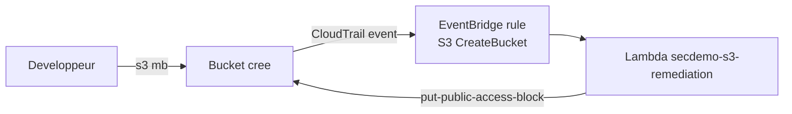

<a id="top"></a>

# Chapitre 7 — Pratique : auto-remédiation S3 (Lambda + EventBridge)

> **Module concerné :** M7 — Incident response.
>
> **Théorie associée :** [`07a-Chapitre7-Theorie-incident-response.md`](07a-Chapitre7-Theorie-incident-response.md)
>
> **Solution exécutable :** [`solutions/tp7b/`](solutions/tp7b/)
>
> **Durée estimée :** 90 minutes.

---

> **Mock vs réel — Lambda + EventBridge :** Lambda et EventBridge fonctionnent bien dans LocalStack. La propagation **CloudTrail → EventBridge** est partielle, donc on **invoque la Lambda manuellement** avec un payload représentatif de l'événement CloudTrail attendu.

---

## Sommaire

- [Objectifs](#objectifs)
- [Prérequis](#prerequis)
- [Scénario](#scenario)
- [Architecture cible](#archi)
- [Plan du TP (parties I à XVI)](#plan)
- [Partie I — Démarrage](#part1)
- [Partie II — Écrire le handler Python](#part2)
- [Partie III — Packager la Lambda avec `archive_file`](#part3)
- [Partie IV — Rôle IAM Lambda et trust policy](#part4)
- [Partie V — Permissions S3 et logs](#part5)
- [Partie VI — Déclarer la Lambda](#part6)
- [Partie VII — Règle EventBridge `S3 CreateBucket`](#part7)
- [Partie VIII — Cible EventBridge et permission](#part8)
- [Partie IX — `terraform apply`](#part9)
- [Partie X — Invoquer la Lambda manuellement](#part10)
- [Partie XI — Vérifier la remédiation](#part11)
- [Partie XII — Inspecter les logs CloudWatch](#part12)
- [Partie XIII — Élargir à d'autres cas (vue d'ensemble)](#part13)
- [Partie XIV — Mini-rapport](#part14)
- [Partie XV — Limites LocalStack](#part15)
- [Partie XVI — Nettoyage](#part16)
- [Barème](#bareme)
- [Corrigé minimal](#corrige)
- [Références](#references)

---

<a id="objectifs"></a>

## Objectifs

À la fin de ce TP, vous saurez :

- écrire un **handler Lambda Python** d'auto-remédiation,
- packager une Lambda en zip avec Terraform `archive_file`,
- créer un **rôle d'exécution** avec une **inline policy** minimale,
- définir une **règle EventBridge** sur un événement CloudTrail,
- relier la règle à une **cible Lambda** avec **permission**,
- **simuler** un événement CloudTrail et observer la remédiation.

---

<a id="prerequis"></a>

## Prérequis

- Docker Desktop démarré.
- `LOCALSTACK_AUTH_TOKEN` valide.
- Avoir lu [`07a`](07a-Chapitre7-Theorie-incident-response.md) et [`03a`](03a-Chapitre3-Theorie-iam.md).

---

<a id="scenario"></a>

## Scénario

Un développeur crée un bucket S3 sans `public access block` (cas classique de fuite). On veut une **réponse automatique en quelques secondes** : la Lambda doit forcer le `public access block` sur le bucket.

---

<a id="archi"></a>

## Architecture cible



---

<a id="plan"></a>

## Plan du TP (parties I à XVI)

| Partie | Sujet |
|---:|---|
| I | Démarrage |
| II | Handler Python |
| III | Packaging zip |
| IV | Rôle IAM + trust |
| V | Permissions inline |
| VI | Lambda |
| VII | Règle EventBridge |
| VIII | Cible + permission |
| IX | apply |
| X | Invocation manuelle |
| XI | Vérifier la remédiation |
| XII | Logs CloudWatch |
| XIII | Autres cas |
| XIV | Mini-rapport |
| XV | Limites LocalStack |
| XVI | Nettoyage |

---

<a id="part1"></a>

## Partie I — Démarrage

```bash
cd aws-security-with-localstack/solutions/tp7b
cp .env.example .env
docker compose build
docker compose up -d localstack tools
docker compose run --rm tools terraform -chdir=terraform init
```

---

<a id="part2"></a>

## Partie II — Écrire le handler Python

Fichier `lambda/handler.py` (déjà fourni dans la solution) :

```python
import json, logging, os
import boto3

LOGGER = logging.getLogger()
LOGGER.setLevel(logging.INFO)

_endpoint = os.environ.get("AWS_ENDPOINT_URL")
s3_client = boto3.client("s3", endpoint_url=_endpoint) if _endpoint else boto3.client("s3")

PUBLIC_ACCESS_BLOCK = {
    "BlockPublicAcls": True, "IgnorePublicAcls": True,
    "BlockPublicPolicy": True, "RestrictPublicBuckets": True,
}

def _extract_bucket_name(event):
    return (event.get("detail") or {}).get("requestParameters", {}).get("bucketName")

def lambda_handler(event, context):
    LOGGER.info("Received: %s", json.dumps(event))
    bucket = _extract_bucket_name(event)
    if not bucket:
        return {"remediated": None, "reason": "no bucketName"}
    s3_client.put_public_access_block(
        Bucket=bucket,
        PublicAccessBlockConfiguration=PUBLIC_ACCESS_BLOCK,
    )
    return {"remediated": bucket, "action": "put-public-access-block"}
```

> **Astuce :** la variable `AWS_ENDPOINT_URL` est automatiquement injectée par LocalStack dans le runtime Lambda pour rediriger les appels SDK vers LocalStack.

---

<a id="part3"></a>

## Partie III — Packager la Lambda avec `archive_file`

```hcl
data "archive_file" "remediation_zip" {
  type        = "zip"
  source_dir  = "${path.module}/../lambda"
  output_path = "${path.module}/build/remediation.zip"
}
```

> **Pourquoi `archive_file` ?** Le provider `archive` zippe automatiquement le dossier `lambda/` à chaque changement. Pas besoin de zipper à la main.

---

<a id="part4"></a>

## Partie IV — Rôle IAM Lambda et trust policy

```hcl
data "aws_iam_policy_document" "lambda_trust" {
  statement {
    actions = ["sts:AssumeRole"]
    principals {
      type        = "Service"
      identifiers = ["lambda.amazonaws.com"]
    }
  }
}

resource "aws_iam_role" "remediation" {
  name               = "${var.project}-remediation-role"
  assume_role_policy = data.aws_iam_policy_document.lambda_trust.json
}
```

---

<a id="part5"></a>

## Partie V — Permissions S3 et logs

```hcl
data "aws_iam_policy_document" "remediation_inline" {
  statement {
    effect    = "Allow"
    actions   = ["s3:GetPublicAccessBlock", "s3:PutPublicAccessBlock", "s3:ListAllMyBuckets"]
    resources = ["*"]
  }
  statement {
    effect    = "Allow"
    actions   = ["logs:CreateLogGroup", "logs:CreateLogStream", "logs:PutLogEvents"]
    resources = ["*"]
  }
}

resource "aws_iam_role_policy" "remediation_inline" {
  name   = "${var.project}-remediation-inline"
  role   = aws_iam_role.remediation.id
  policy = data.aws_iam_policy_document.remediation_inline.json
}
```

> **Astuce :** en production, restreindre `Resource = "*"` au strict minimum (préfixes de buckets attendus).

---

<a id="part6"></a>

## Partie VI — Déclarer la Lambda

```hcl
resource "aws_lambda_function" "remediation" {
  function_name    = "${var.project}-s3-remediation"
  role             = aws_iam_role.remediation.arn
  handler          = "handler.lambda_handler"
  runtime          = var.lambda_runtime
  filename         = data.archive_file.remediation_zip.output_path
  source_code_hash = data.archive_file.remediation_zip.output_base64sha256
  timeout          = 30
}
```

---

<a id="part7"></a>

## Partie VII — Règle EventBridge `S3 CreateBucket`

```hcl
resource "aws_cloudwatch_event_rule" "on_create_bucket" {
  name = "${var.project}-on-create-bucket"
  event_pattern = jsonencode({
    source        = ["aws.s3"]
    "detail-type" = ["AWS API Call via CloudTrail"]
    detail = {
      eventSource = ["s3.amazonaws.com"]
      eventName   = ["CreateBucket"]
    }
  })
}
```

> **Note :** en AWS réel, CloudTrail Data Events doit être activé pour que cet événement parte. En LocalStack, on simulera l'invocation.

---

<a id="part8"></a>

## Partie VIII — Cible EventBridge et permission

```hcl
resource "aws_cloudwatch_event_target" "lambda_target" {
  rule      = aws_cloudwatch_event_rule.on_create_bucket.name
  target_id = "${var.project}-lambda"
  arn       = aws_lambda_function.remediation.arn
}

resource "aws_lambda_permission" "allow_events" {
  statement_id  = "AllowExecutionFromEventBridge"
  action        = "lambda:InvokeFunction"
  function_name = aws_lambda_function.remediation.function_name
  principal     = "events.amazonaws.com"
  source_arn    = aws_cloudwatch_event_rule.on_create_bucket.arn
}
```

---

<a id="part9"></a>

## Partie IX — `terraform apply`

```bash
docker compose run --rm tools terraform -chdir=terraform apply -auto-approve
docker compose run --rm tools aws --endpoint-url=http://localstack:4566 lambda list-functions
docker compose run --rm tools aws --endpoint-url=http://localstack:4566 events list-rules
```

---

<a id="part10"></a>

## Partie X — Invoquer la Lambda manuellement

> **Pourquoi manuellement ?** La propagation CloudTrail → EventBridge n'est pas garantie en LocalStack Hobby. On simule donc l'événement.

```bash
docker compose run --rm tools bash -lc '
aws --endpoint-url=http://localstack:4566 s3 mb s3://test-public-bucket
cat > /tmp/event.json <<EOF
{
  "source": "aws.s3",
  "detail-type": "AWS API Call via CloudTrail",
  "detail": {
    "eventName": "CreateBucket",
    "requestParameters": { "bucketName": "test-public-bucket" }
  }
}
EOF
aws --endpoint-url=http://localstack:4566 lambda invoke \
  --function-name secdemo-s3-remediation \
  --payload file:///tmp/event.json /tmp/out.json
cat /tmp/out.json
'
```

---

<a id="part11"></a>

## Partie XI — Vérifier la remédiation

```bash
docker compose run --rm tools aws --endpoint-url=http://localstack:4566 s3api get-public-access-block --bucket test-public-bucket
```

> Attendu : 4 cases à `true`.

---

<a id="part12"></a>

## Partie XII — Inspecter les logs CloudWatch

```bash
docker compose run --rm tools aws --endpoint-url=http://localstack:4566 logs describe-log-groups --log-group-name-prefix /aws/lambda/secdemo-s3-remediation
docker compose run --rm tools aws --endpoint-url=http://localstack:4566 logs filter-log-events --log-group-name /aws/lambda/secdemo-s3-remediation || true
```

---

<a id="part13"></a>

## Partie XIII — Élargir à d'autres cas (vue d'ensemble)

| Détection | Remédiation Lambda |
|---|---|
| SG `0.0.0.0/0` sur port 22 | retirer la règle |
| Clé d'accès IAM > 90 jours | désactiver la clé |
| Bucket sans encryption | `put-bucket-encryption` |
| Instance EC2 communique avec C2 | snapshot + isolement |

---

<a id="part14"></a>

## Partie XIV — Mini-rapport

1. Quelle est la **trust policy** d'une Lambda et à quoi sert-elle ?
2. Pourquoi définir le `source_arn` dans `aws_lambda_permission` ?
3. Quelles permissions minimales doit avoir le rôle ?
4. Qu'est-ce qui manque pour que le pipeline soit **réellement** déclenché par AWS ?
5. Quels autres cas pourrait-on automatiser ?

---

<a id="part15"></a>

## Partie XV — Limites LocalStack

- CloudTrail → EventBridge non garanti.
- Lambdas en runtime Docker plus lentes au premier appel (cold start).
- Pas de SNS email réel.

---

<a id="part16"></a>

## Partie XVI — Nettoyage

```bash
docker compose run --rm tools terraform -chdir=terraform destroy -auto-approve
docker compose down -v
```

---

<a id="bareme"></a>

## Barème (50 points)

| Partie | Points |
|---:|---:|
| I — démarrage | 2 |
| II — handler | 6 |
| III — packaging | 4 |
| IV — rôle trust | 4 |
| V — permissions inline | 5 |
| VI — Lambda | 5 |
| VII — règle EventBridge | 6 |
| VIII — cible + permission | 5 |
| IX — apply | 2 |
| X — invocation | 4 |
| XI — vérification | 4 |
| XII — logs | 2 |
| XIV — mini-rapport | 1 |
| **Total** | **50** |

---

<a id="corrige"></a>

## Corrigé minimal

Voir [`solutions/tp7b/`](solutions/tp7b/).

---

<a id="references"></a>

## Références

- AWS — Lambda : https://docs.aws.amazon.com/lambda/
- AWS — EventBridge Patterns : https://docs.aws.amazon.com/eventbridge/latest/userguide/eb-event-patterns.html
- AWS — Lambda Permissions : https://docs.aws.amazon.com/lambda/latest/dg/access-control-resource-based.html
- Terraform — `archive_file` : https://registry.terraform.io/providers/hashicorp/archive/latest/docs/data-sources/file

---

⬅ [`07a-Chapitre7-Theorie-incident-response.md`](07a-Chapitre7-Theorie-incident-response.md) | 🏠 [`README.md`](README.md) | ➡ [`08a-Chapitre8-Theorie-bridging-to-certification.md`](08a-Chapitre8-Theorie-bridging-to-certification.md)

<p align="right"><a href="#top">↑ Retour en haut</a></p>
