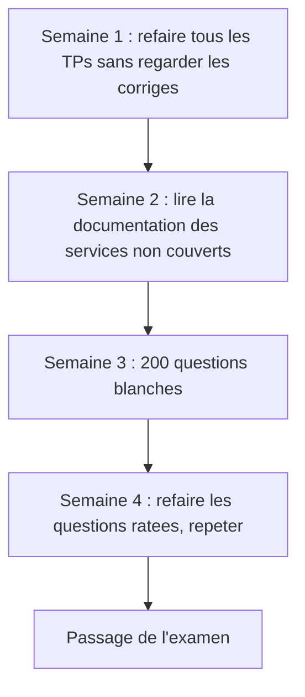

# Chapitre 8 — Théorie : préparer la certification AWS Security (SCS-C02)

> **Objectif du module :** faire le pont entre ce que vous avez vu en LocalStack et les compétences attendues par l'examen **AWS Certified Security – Specialty (SCS-C02)**, et identifier les **lacunes** à combler avant l'examen.

---

## Sommaire

1. [À propos de la certification SCS-C02](#scs)
2. [Les 6 domaines de l'examen](#domaines)
3. [Ce que ce cours couvre vraiment](#couvert)
4. [Ce que ce cours NE couvre PAS](#non-couvert)
5. [Plan de révision suggéré](#plan)
6. [Ressources officielles](#officielles)
7. [Quiz d'auto-évaluation](#quiz)
8. [Références](#references)

---

## 1. À propos de la certification SCS-C02

- **Nom :** AWS Certified Security – Specialty
- **Code :** SCS-C02
- **Format :** 65 questions, 170 minutes, QCM et QCM multi-réponses
- **Coût :** ~ 300 USD
- **Validité :** 3 ans
- **Niveau recommandé :** 5 ans d'expérience IT, dont 2+ en sécurité AWS

---

## 2. Les 6 domaines de l'examen

| # | Domaine | Poids | Couvert par ce cours |
|---:|---|---:|---|
| 1 | Threat detection and incident response | 14 % | Théorie M2, M6, M7 + TP 6, TP 7 |
| 2 | Security logging and monitoring | 18 % | Théorie M6 + TP 6 |
| 3 | Infrastructure security | 20 % | Théorie M4 + TP 4 |
| 4 | Identity and access management | 16 % | Théorie M3 + TP 3 |
| 5 | Data protection | 18 % | Théorie M5 + TP 5 |
| 6 | Management and security governance | 14 % | Théorie M2, M8 |

---

## 3. Ce que ce cours couvre vraiment

| Compétence attendue | Module |
|---|---|
| Comprendre le shared responsibility model | M2 |
| Écrire et raisonner sur des policies IAM | M3 |
| Construire un VPC sécurisé (subnets, SG, NACL) | M4 |
| Chiffrement at rest et en transit, KMS | M5 |
| CloudWatch logs / alarms | M6 |
| Lambda d'auto-remédiation, EventBridge | M7 |
| Modèles de défense en profondeur | M2, M4 |

---

## 4. Ce que ce cours NE couvre PAS

> **Important :** ces sujets sont **dans l'examen** mais **non couverts** dans le cours faute d'émulation LocalStack. À étudier en théorie via la documentation AWS et des labs sur compte réel.

| Sujet | Pourquoi pas couvert | Comment combler |
|---|---|---|
| **AWS Organizations / SCPs** | Multi-comptes, pas émulé | AWS Skill Builder, labs sur AWS Sandbox |
| **GuardDuty** | Plan LocalStack Pro | Lecture doc + lab AWS Free Tier |
| **Security Hub** | Plan LocalStack Pro | Lecture doc + lab AWS Free Tier |
| **AWS Config rules** | Plan LocalStack Pro | Lecture doc + lab AWS Free Tier |
| **ACM, CloudFront, WAF, Shield** | Non émulé fidèlement | Lecture doc + diagrams |
| **Macie, Inspector, Detective** | Non émulés | Lecture doc |
| **VPC Flow Logs** | Émulation partielle | Lab sur compte réel |
| **IAM Identity Center (SSO)** | Non émulé | Lecture doc |
| **Cross-account roles complexes** | Multi-comptes | Lecture doc |

---

## 5. Plan de révision suggéré

- Refaire les 5 TPs **sans regarder le corrigé**.
- Lire la doc officielle des services non couverts.
- Faire 200+ questions blanches (officielles AWS + Tutorials Dojo).
- Refaire les questions où vous avez échoué.

---

## 6. Ressources officielles

- Exam Guide SCS-C02 : https://d1.awsstatic.com/training-and-certification/docs-security-specialty/AWS-Certified-Security-Specialty_Exam-Guide.pdf
- Sample Questions : https://d1.awsstatic.com/training-and-certification/docs-security-specialty/AWS-Certified-Security-Specialty_Sample-Questions.pdf
- AWS Skill Builder — Exam Prep : https://explore.skillbuilder.aws/

---

## 7. Quiz d'auto-évaluation

1. Quel est le domaine le plus volumineux de l'examen ?
2. Combien de domaines compte l'examen ?
3. Citez trois services AWS de **détection** non couverts par ce cours.
4. Quels modules de ce cours préparent le mieux le domaine **Data protection** ?
5. Pourquoi LocalStack ne suffit pas à valider GuardDuty ?

> Réponses : 1. Infrastructure security (20 %). 2. 6. 3. GuardDuty, Security Hub, AWS Config. 4. M5. 5. GuardDuty utilise du ML sur des sources qui ne sont pas reproduites localement.

---

## 8. Références

- Exam Guide : https://d1.awsstatic.com/training-and-certification/docs-security-specialty/AWS-Certified-Security-Specialty_Exam-Guide.pdf
- AWS — Security Documentation : https://docs.aws.amazon.com/security/
- AWS Well-Architected — Security Pillar : https://docs.aws.amazon.com/wellarchitected/latest/security-pillar/welcome.html

---

⬅ Précédent : [`07b-Chapitre7-Pratique-lambda-eventbridge-auto-remediation.md`](07b-Chapitre7-Pratique-lambda-eventbridge-auto-remediation.md)  
🏠 Retour : [`README.md`](README.md)
