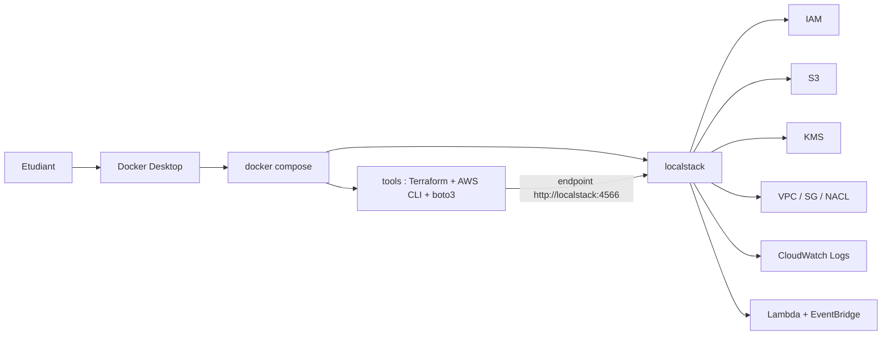
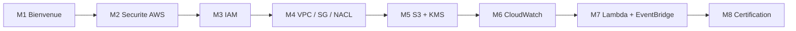

# Cours — Sécurité AWS avec LocalStack

> **Public visé :** étudiants débutants à intermédiaires en sécurité cloud, qui veulent comprendre les contrôles de sécurité AWS sans payer un compte AWS.
>
> **Niveau :** Débutant à intermédiaire.
>
> **Durée totale estimée :** ~20 à 25 heures (8 modules, 5 TPs guidés).
>
> **Méthode unique :** Docker Compose + `Dockerfile.tools` (Terraform et AWS CLI dans un conteneur). LocalStack tourne dans Docker. Auth Token LocalStack **obligatoire** (plan Hobby ou Student).
>
> **Mode de travail :** individuel ou en binôme.
>
> **Langue du cours :** français.

---

## Sommaire

1. [À qui s'adresse ce cours ?](#a-qui)
2. [Ce que vous saurez faire à la fin](#objectifs)
3. [Architecture pédagogique](#architecture)
4. [Prérequis logiciels](#prerequis)
5. [Structure des fichiers du cours](#structure)
6. [Plan du cours — 8 modules](#plan)
7. [Ce que LocalStack permet et ce qu'il ne permet pas](#localstack)
8. [Comment travailler ce cours](#methode)
9. [Conventions du cours](#conventions)
10. [Dépannage rapide](#depannage)
11. [Cheat sheet — commandes utiles](#cheatsheet)
12. [Références utiles](#references)

---

<a id="a-qui"></a>

## À qui s'adresse ce cours ?

Ce cours s'adresse à toute personne qui souhaite apprendre la **sécurité AWS** sans créer de compte AWS payant et sans risquer de coûts.

Toutes les ressources sont créées dans **LocalStack**, qui simule les APIs AWS localement dans un conteneur Docker. Vous apprenez la **syntaxe** et la **logique** des contrôles de sécurité AWS (IAM, VPC, S3, KMS, CloudWatch, Lambda) avec un code Terraform qui fonctionnerait presque à l'identique sur le vrai AWS.

> **Important — limites de LocalStack :** LocalStack **ne reproduit pas tous les comportements de sécurité du vrai AWS**. Les politiques IAM ne sont pas appliquées par défaut, les Security Groups n'effectuent aucun filtrage réseau réel, etc. Le détail est dans [`00-theorie-aws-security-localstack.md`](00-theorie-aws-security-localstack.md). Chaque TP est encadré pour clarifier ce qui est réel et ce qui est mocké.

**Prérequis pédagogiques :**

- Savoir ouvrir un terminal.
- Notions minimales de ligne de commande (`cd`, `ls`).
- Une connaissance de base d'AWS aide mais n'est pas obligatoire.
- Aucune connaissance préalable de Terraform ou Docker n'est requise.

---

<a id="objectifs"></a>

## Ce que vous saurez faire à la fin

- Décrire le **modèle de responsabilité partagée** AWS et appliquer les **principes de conception** sécurisés.
- Créer des **utilisateurs, groupes, rôles et policies IAM** en Terraform et comprendre le format JSON des policies.
- Construire un **VPC** avec sous-réseaux publics et privés, **Security Groups** et **NACL**.
- **Sécuriser un bucket S3** : versioning, public access block, server-side encryption, bucket policy.
- Créer une **clé KMS** et chiffrer / déchiffrer des données avec `boto3`.
- Mettre en place du **logging et monitoring** avec CloudWatch Logs, metric filters et alarms.
- Implémenter une **auto-remédiation simple** avec Lambda et EventBridge.
- Identifier les **services AWS de sécurité** non couverts par LocalStack en plan gratuit et savoir pourquoi.

---

<a id="architecture"></a>

## Architecture pédagogique



**Logique générale :**

- Vous n'installez **rien d'autre que Docker Desktop** sur la machine.
- `Dockerfile.tools` fournit Terraform, AWS CLI et `boto3` dans un conteneur.
- LocalStack tourne dans un autre conteneur avec votre `LOCALSTACK_AUTH_TOKEN`.
- Le réseau Docker permet aux deux conteneurs de communiquer via `http://localstack:4566`.

---

<a id="prerequis"></a>

## Prérequis logiciels

À installer **avant de commencer le module 3** :

| Outil | Vérification | Lien d'installation |
|---|---|---|
| **Docker Desktop** | `docker --version` | https://www.docker.com/products/docker-desktop |
| **Docker Compose v2** | `docker compose version` | inclus avec Docker Desktop |
| **VS Code (recommandé)** | éditeur | https://code.visualstudio.com/ |

> **Important :** Docker Desktop doit être **démarré** (icône verte) avant chaque session.

### Compte LocalStack (obligatoire)

- Créer un compte gratuit sur https://app.localstack.cloud/sign-up
- Choisir le plan **Hobby** (immédiat, gratuit, non-commercial) ou **Student** (gratuit via GitHub Education).
- Récupérer un **Auth Token** dans `app.localstack.cloud` → `Auth Tokens`.
- Coller ce token dans `.env` de chaque TP.

Aucun compte AWS n'est nécessaire.

---

<a id="structure"></a>

## Structure des fichiers du cours

```text
aws-security-with-localstack/
├── README.md                                       (ce fichier)
│
├── 00-theorie-aws-security-localstack.md           tableau de compatibilité LocalStack
│
├── 01a-Chapitre1-Theorie-bienvenue.md              M1 : intro, objectifs, plan
├── 02a-Chapitre2-Theorie-securite-aws.md           M2 : modèle de responsabilité partagée
│
├── 03a-Chapitre3-Theorie-iam.md                    M3 : concepts IAM
├── 03b-Chapitre3-Pratique-iam-users-groups-roles-policies.md  M3 : TP
│
├── 04a-Chapitre4-Theorie-vpc-securite.md           M4 : concepts VPC
├── 04b-Chapitre4-Pratique-vpc-sg-nacl-iac.md       M4 : TP
│
├── 05a-Chapitre5-Theorie-protection-donnees.md     M5 : chiffrement
├── 05b-Chapitre5-Pratique-s3-hardening-kms.md      M5 : TP
│
├── 06a-Chapitre6-Theorie-logging-monitoring.md     M6 : logging et monitoring
├── 06b-Chapitre6-Pratique-cloudwatch-logs-alarms.md  M6 : TP
│
├── 07a-Chapitre7-Theorie-incident-response.md      M7 : incident response
├── 07b-Chapitre7-Pratique-lambda-eventbridge-auto-remediation.md  M7 : TP
│
├── 08a-Chapitre8-Theorie-bridging-to-certification.md  M8 : préparer SCS-C02
│
└── solutions/                                      projets exécutables
    ├── README.md
    ├── tp3b/   IAM
    ├── tp4b/   VPC + SG + NACL
    ├── tp5b/   S3 hardening + KMS
    ├── tp6b/   CloudWatch
    └── tp7b/   Lambda + EventBridge auto-remédiation
```

### Légende des suffixes

| Suffixe | Sens |
|---|---|
| `Na-` | Théorie du module N |
| `Nb-` | TP guidé du module N (seulement les modules 3 à 7) |

---

<a id="plan"></a>

## Plan du cours — 8 modules

| # | Module | Type | Document(s) | Lab |
|---:|---|---|---|---|
| 1 | Bienvenue | Théorie | [`01a-...md`](01a-Chapitre1-Theorie-bienvenue.md) | — |
| 2 | Introduction à la sécurité AWS | Théorie | [`02a-...md`](02a-Chapitre2-Theorie-securite-aws.md) | — |
| 3 | IAM | Théorie + pratique | [`03a-...md`](03a-Chapitre3-Theorie-iam.md), [`03b-...md`](03b-Chapitre3-Pratique-iam-users-groups-roles-policies.md) | [`solutions/tp3b/`](solutions/tp3b/) |
| 4 | Infrastructure VPC / SG / NACL | Théorie + pratique | [`04a-...md`](04a-Chapitre4-Theorie-vpc-securite.md), [`04b-...md`](04b-Chapitre4-Pratique-vpc-sg-nacl-iac.md) | [`solutions/tp4b/`](solutions/tp4b/) |
| 5 | Protection des données (S3 + KMS) | Théorie + pratique | [`05a-...md`](05a-Chapitre5-Theorie-protection-donnees.md), [`05b-...md`](05b-Chapitre5-Pratique-s3-hardening-kms.md) | [`solutions/tp5b/`](solutions/tp5b/) |
| 6 | Logging et monitoring | Théorie + pratique | [`06a-...md`](06a-Chapitre6-Theorie-logging-monitoring.md), [`06b-...md`](06b-Chapitre6-Pratique-cloudwatch-logs-alarms.md) | [`solutions/tp6b/`](solutions/tp6b/) |
| 7 | Incident response | Théorie + pratique | [`07a-...md`](07a-Chapitre7-Theorie-incident-response.md), [`07b-...md`](07b-Chapitre7-Pratique-lambda-eventbridge-auto-remediation.md) | [`solutions/tp7b/`](solutions/tp7b/) |
| 8 | Préparer la certification SCS-C02 | Théorie | [`08a-...md`](08a-Chapitre8-Theorie-bridging-to-certification.md) | — |

### Progression



---

<a id="localstack"></a>

## Ce que LocalStack permet et ce qu'il ne permet pas

Détail complet dans [`00-theorie-aws-security-localstack.md`](00-theorie-aws-security-localstack.md). Vue rapide :

| Sujet | LocalStack | Couvert en TP |
|---|---|---|
| IAM users/groups/roles/policies (création + syntaxe) | OK | TP 3 |
| IAM enforcement (les policies bloquent vraiment) | Mock par défaut | Avertissement TP 3 |
| S3 bucket policies, versioning, encryption, public access block | OK | TP 5 |
| KMS keys + chiffrement / déchiffrement | OK | TP 5 |
| VPC, subnets, IGW, route tables | API OK, pas d'isolation réelle | TP 4 (syntaxe IaC) |
| Security Groups / NACL (filtrage réel) | Mock | Avertissement TP 4 |
| CloudWatch Logs, metric filters, alarms | OK | TP 6 |
| Lambda + EventBridge rule | OK | TP 7 |
| **AWS Organizations / SCPs** | Pro / non couvert | Théorie uniquement |
| **Security Hub** | Pro / non couvert | Théorie uniquement |
| **GuardDuty** | Pro / non couvert | Théorie uniquement |
| **AWS Config rules** | Pro / non couvert | Théorie uniquement |
| **ELB / ACM / TLS** | Pro ou non pertinent en local | Théorie uniquement |

---

<a id="methode"></a>

## Comment travailler ce cours

1. Lire [`00-theorie-aws-security-localstack.md`](00-theorie-aws-security-localstack.md) en entier.
2. Lire chaque `Na-...md` avant son TP `Nb-...md`.
3. Faire les TPs **dans l'ordre 3 → 4 → 5 → 6 → 7**.
4. Pour chaque TP : démarrer Docker Desktop, copier `.env.example` vers `.env`, coller votre `LOCALSTACK_AUTH_TOKEN`, suivre les commandes du TP.
5. À la fin de chaque session : `docker compose down -v` pour libérer les ressources.

---

<a id="conventions"></a>

## Conventions du cours

| Encadré | Sens |
|---|---|
| `> **Objectif :** …` | But de la partie |
| `> **Astuce :** …` | Bon réflexe |
| `> **Attention :** …` | Erreur fréquente à éviter |
| `> **Réel vs mock :** …` | Différence entre LocalStack et le vrai AWS |
| `> **Pourquoi ?**` | Justification pédagogique |

Tous les blocs de commandes sont fournis en **PowerShell** et **Bash** quand cela diffère.

---

<a id="depannage"></a>

## Dépannage rapide

| Symptôme | Vérifier en priorité |
|---|---|
| `cannot connect to the Docker daemon` | Docker Desktop est-il démarré ? |
| `LOCALSTACK_AUTH_TOKEN is required` | `.env` contient bien votre token ? |
| `port is already allocated` (4566) | Un autre conteneur LocalStack tourne déjà |
| Terraform appelle le vrai AWS | Bloc `endpoints` manquant dans `provider.tf` |
| `aws ... Unable to locate credentials` | Variables `AWS_ACCESS_KEY_ID=test` non transmises au conteneur |

---

<a id="cheatsheet"></a>

## Cheat sheet — commandes utiles

```bash
docker compose build
docker compose up -d localstack tools
docker compose run --rm tools terraform -chdir=terraform init
docker compose run --rm tools terraform -chdir=terraform plan
docker compose run --rm tools terraform -chdir=terraform apply -auto-approve
docker compose run --rm tools terraform -chdir=terraform destroy -auto-approve
docker compose run --rm tools aws --endpoint-url=http://localstack:4566 iam list-users
docker compose run --rm tools aws --endpoint-url=http://localstack:4566 s3 ls
docker compose run --rm tools aws --endpoint-url=http://localstack:4566 logs describe-log-groups
docker compose down -v
```

---

<a id="references"></a>

## Références utiles

- AWS — Modèle de responsabilité partagée : https://aws.amazon.com/compliance/shared-responsibility-model/
- AWS — IAM Best Practices : https://docs.aws.amazon.com/IAM/latest/UserGuide/best-practices.html
- AWS — Well-Architected Framework, pilier Sécurité : https://docs.aws.amazon.com/wellarchitected/latest/security-pillar/welcome.html
- AWS — KMS : https://docs.aws.amazon.com/kms/
- AWS — VPC Security : https://docs.aws.amazon.com/vpc/latest/userguide/vpc-security-best-practices.html
- AWS — CloudWatch : https://docs.aws.amazon.com/AmazonCloudWatch/
- LocalStack — Services coverage : https://docs.localstack.cloud/aws/integrations/aws-sdks/
- LocalStack — Auth Token : https://docs.localstack.cloud/aws/getting-started/auth-token/
- Terraform — Provider AWS : https://registry.terraform.io/providers/hashicorp/aws/latest/docs
- Certification AWS Security Specialty (SCS-C02) : https://aws.amazon.com/certification/certified-security-specialty/

---

*Fin du README — bonne pratique de la sécurité AWS dans LocalStack.*

<p align="right"><a href="#top">↑ Retour en haut</a></p>
# aws-security-with-localstack


