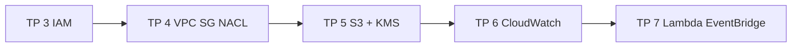

<a id="top"></a>

# Solutions — cours « Sécurité AWS avec LocalStack »

Ce dossier contient **un projet autonome et exécutable** par TP. Chaque sous-dossier correspond à l'**état final attendu** du TP correspondant.

> **Méthode unique :** Docker Compose + `Dockerfile.tools` + Auth Token LocalStack.  
> **Aucun outil** (Terraform, AWS CLI, Python) n'est requis hors Docker Desktop.

---

## Sommaire des solutions

| TP | Sujet | Document pédagogique | Dossier |
|---:|---|---|---|
| 3 | IAM (users, groups, roles, policies) | [`../03b-...md`](../03b-Chapitre3-Pratique-iam-users-groups-roles-policies.md) | [`tp3b/`](tp3b/) |
| 4 | VPC + Security Groups + NACL | [`../04b-...md`](../04b-Chapitre4-Pratique-vpc-sg-nacl-iac.md) | [`tp4b/`](tp4b/) |
| 5 | S3 hardening + KMS | [`../05b-...md`](../05b-Chapitre5-Pratique-s3-hardening-kms.md) | [`tp5b/`](tp5b/) |
| 6 | CloudWatch Logs + Metric Filters + Alarms | [`../06b-...md`](../06b-Chapitre6-Pratique-cloudwatch-logs-alarms.md) | [`tp6b/`](tp6b/) |
| 7 | Lambda + EventBridge auto-remédiation | [`../07b-...md`](../07b-Chapitre7-Pratique-lambda-eventbridge-auto-remediation.md) | [`tp7b/`](tp7b/) |

---

## Vue d'ensemble du parcours



Chaque TP est **indépendant**. Vous pouvez les exécuter dans n'importe quel ordre, mais l'ordre **3 → 7** correspond à la progression pédagogique.

---

## Structure type d'un dossier `tpNb/`

```text
tpNb/
├── .env.example         token LocalStack
├── .gitignore           ignore .env, .terraform/, *.tfstate, volume/
├── docker-compose.yml   services : localstack + tools
├── Dockerfile.tools     image avec Terraform, AWS CLI, boto3
├── README.md            instructions et commandes
└── terraform/
    ├── provider.tf      pointe vers http://localstack:4566
    ├── variables.tf
    ├── main.tf
    └── outputs.tf
```

Le TP 7 ajoute un dossier `lambda/` avec le handler Python.

---

## Démarrage générique (vrai pour chaque `tpNb/`)

```bash
cd aws-security-with-localstack/solutions/tpNb

# Préparer le token
cp .env.example .env
# Editer .env et coller votre LOCALSTACK_AUTH_TOKEN

# Construire et lancer
docker compose build
docker compose up -d localstack tools

# Appliquer Terraform
docker compose run --rm tools terraform -chdir=terraform init
docker compose run --rm tools terraform -chdir=terraform plan
docker compose run --rm tools terraform -chdir=terraform apply -auto-approve

# ... voir le README.md du TP pour les commandes de validation ...

# Nettoyage
docker compose run --rm tools terraform -chdir=terraform destroy -auto-approve
docker compose down -v
```

---

## Conventions communes

| Élément | Valeur |
|---|---|
| Préfixe ressources | `secdemo` (modifiable via `var.project`) |
| Endpoint LocalStack | `http://localstack:4566` |
| `AWS_ACCESS_KEY_ID` / `SECRET` | `test` / `test` |
| Région | `us-east-1` |
| Runtime Lambda | `python3.11` |

---

## Ce qui est **mocké** (rappel)

Voir le détail dans [`../00-theorie-aws-security-localstack.md`](../00-theorie-aws-security-localstack.md).

| Sujet | LocalStack |
|---|---|
| IAM enforcement | mocké — la syntaxe est apprise, pas l'effet |
| SG / NACL | aucune application réelle |
| CloudTrail | partiel |
| GuardDuty / Security Hub / AWS Config | non disponibles en plan gratuit |

---

## Vérifier rapidement la cohérence d'un TP

```bash
cd aws-security-with-localstack/solutions/tpNb
docker compose --env-file .env.example config --quiet && echo OK
```

> **Astuce :** ce check valide que le `docker-compose.yml` est syntaxiquement correct et que toutes les variables sont fournies.

<p align="right"><a href="#top">↑ Retour en haut</a></p>
